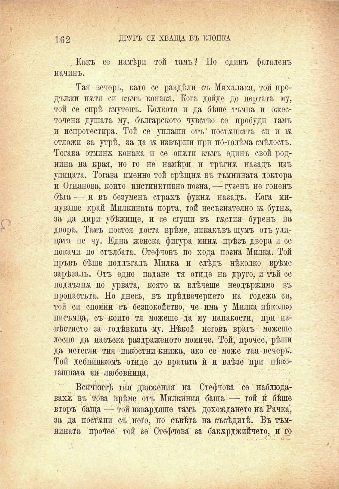

Какъ се намѣри той тамъ? По единъ фаталенъ начинъ.

Тая вечерь, като се раздѣли съ Мпхалакя, той продължн пжтя си къмъ конака. Кога дойде до портата му, той се спрѣ смутенъ. Колкото и да бѣше тъмна и ожесточена душата му, българското чувство се пробуди тамъ и испротестира. Той се уплаши отъ* постѫпката си и ж отложи за утрѣ, за да ж извърши при по́-голѣма смѣлость. Тогава отмина конака и се оп&тп къмъ единъ свой роднина на края, но го не намѣри и тръгнж назадъ изъ улицата. Тогава именно той срѣщна въ тъмнината доктора п Огнянова, който инстинктивно позна, — гузенъ не гоненъ бѣга — и въ безуменъ страхъ фукня. назадъ. Кога мпнуваше край Милкината порта, той несъзнателно ж бутнж, .	за да дири убѣжище, и се сгуши въ гѫстия буренъ на

двора. Тамъ постоя доста врѣме, никакъвъ шумъ отъ улицата не чу. Една женска фигура минж. прѣзъ двора и се покачи по стълбата. Стефчовъ по хода позна Милка. Той пръвъ бѣше подлъгалъ Милка и слѣдъ нѣколко врѣме зарѣзалъ. Отъ едно падане тя отиде на друго, и тъй се подлъзня по урвата, която тя влѣчеше неодържимо въ пропастьта. Но днесъ, въ прѣдвечерието на годежа сп, той си спомни съ безпокойство, че има у Милка нѣколко писъмца, съ който тя можеше да му напакости, при извѣстието за годѣвката му. Нѣкой неговъ врагъ можеше лесно да насъска раздраженото момиче. Той, прочее, рѣши да истегли тия пакостни книжа, ако се може тая вечерь. Той дебнешкомъ отиде до вратата ѝ и влѣзе при нѣкогашната си любовница,

Всичкитѣ тия движения на Стефчова се наблюдаваха въ това врѣме отъ Милки́ния баща —•_ той и́ бѣше вторъ баща — той извардяше тамъ дохождането на Рачка, за да постѫпи съ него, по съвѣта на съсѣдитѣ. Въ тъмнината прочее той зе Стефчова за бакярджийчето, и го

