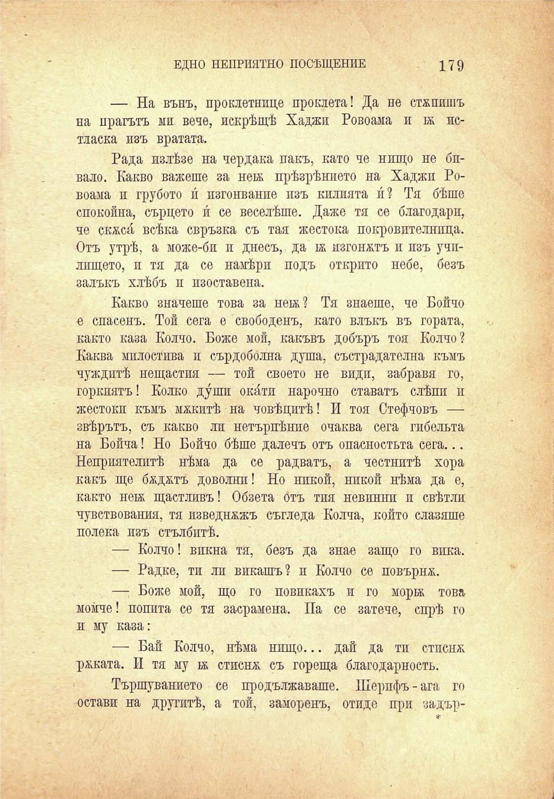

ЕДНО НЕПРИЯТНО ПОСЕЩЕНИЕ

179

— На вънъ, проклетнице проклета! Да не стапяшъ на прагътъ ми вече, искрѣщѣ Хаджи Ровоама и истласка изъ вратата.

Рада излѣзе на чердака пакъ, като че нищо не бпвало. Какво важеше за не1я прѣзрѣнпето на Хаджи Ровоама и грубото и́ пзгонвание изъ килията и́? Тя бѣше спокойна, сърцето и́ се веселѣше. Даже тя се благодари, че скяси́ всѣка свръзка съ тая жестока покровителнпца. Отъ утрѣ, а може-би и днесъ, да 1Я изгонятъ и изъ учплшцето, и тя да се намѣри подъ открито небе, безъ залъкъ хлѣбъ и изоставена.

Какво значеше това за нек? Тя знаеше, че Бойчо е спасенъ. Той сега е свободенъ, като влъкъ въ гората, както каза Колчо. Боже мой, какъвъ добъръ тоя Колчо? Каква милостива и сърдобо́лна душа, състрадателна къмъ чуждитѣ нещастия — той своето не види, забравя го, горкиятъ! Колко души оки́ти нарочно ставатъ слѣпи и жестоки къмъ мякитѣ на човѣцитѣ! И тоя Стефчовъ — звѣрътъ, съ какво ли нетърпѣнпе очаква сега гибельта на Бойча! Но Бойчо бѣше далечъ отъ опасностьта сега... Неприятелитѣ нѣма да се радватъ, а честнитѣ хора какъ ще бядятъ доволни! Но никой, никой нѣма да е, както неѭ щастливъ! Обзета отъ тия невинни и свѣтли чувствования, тя изведняжъ съгледа Колча, който слазяше полека изъ стълбитѣ.

— Колчо! викна тя, безъ да знае защо го вика.

— Радке, ти ли викашъ? и Колчо се повърня.

— Боже мой, що го повикахъ и го мортж това момче! попита се тя засрамена. Па се затече, спрѣ го и му каза:

— Бай Колчо, нѣма нищо... дай да тп стпсня ряката. И тя му ьк стисня съ гореща благодарность.

Тършуванието се продължаваше. Шерифъ - ага го остави на другитѣ, а той, заморенъ, отиде при задър-

