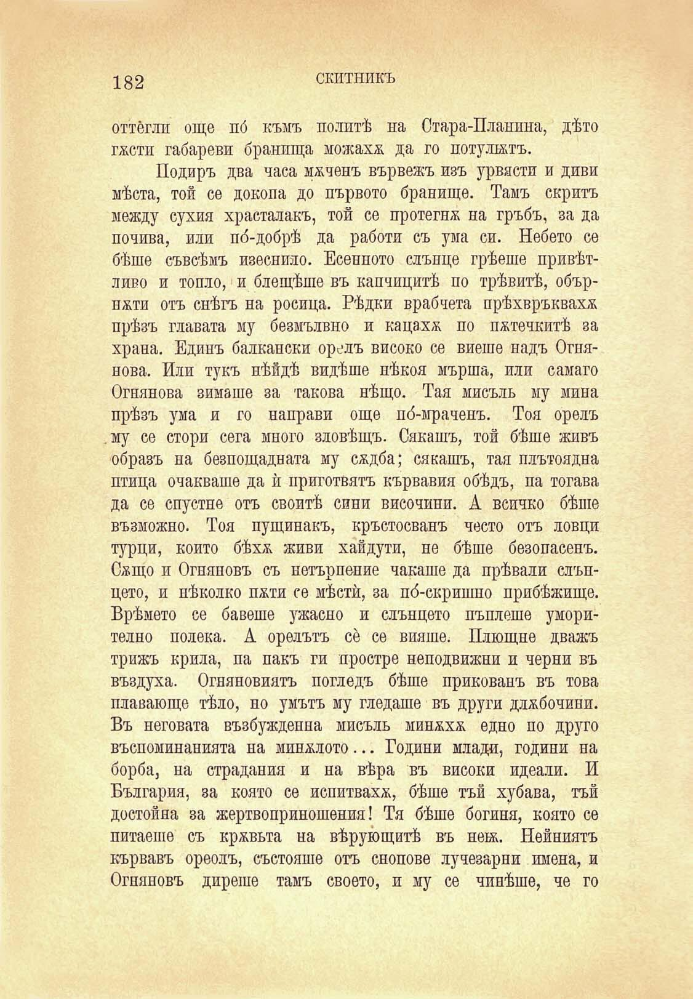

182

скитникъ

оттегли още пб къмъ политѣ на Стара-Планина, дѣто гжстп габареви бранища можаха да го потулятъ.

Подиръ два часа мжченъ вървежъ изъ урвясти и диви мѣста, той се докопа до първото бранище. Тамъ скритъ между сухия храсталакъ, той се протегна на гръбъ, за да почива, или по́-добрѣ да работи съ ума си. Небето се бѣше съвсѣмъ изеснило. Есенното слънце грѣеше привѣтливо и топло, и блещѣше въ капчицитѣ по трѣвитѣ, обърнжти отъ снѣгъ на росица. Рѣдки врабчета прѣхвръкваха прѣзъ главата му безмълвно и кацаха по пжтечкитѣ за храна. Единъ балкански орелъ високо се виеше надъ Огнянова. Или тукъ нѣйдѣ видѣше нѣкоя мърша, или самаго Огнянова зимаше за такова нѣщо. Тая мисъль му мина прѣзъ ума и го направи още по́-мраченъ. Тоя орелъ му се стори сега много зловѣщъ. Сякашъ, той бѣше живъ образъ на безпощадната му сждба; сякашъ, тая плътоядна птица очакваше да ѝ приготвятъ кървавия обѣдъ, па тогава да се спустне отъ своитѣ сини височини. А всичко бѣше възможно. Тоя пущинакъ, кръстосванъ често отъ ловци турци, който бѣхѫ живи хайдути, не бѣше безопасенъ. Сжщо и Огняновъ съ нетърпение чакаше да прѣвали слънцето, и нѣколко п&ти се мѣстѝ, за по́-скришно прибѣжище. Врѣмето се бавеше ужасно и слънцето пъплеше уморително полека. А орелътъ се се вияше. Плющне дважъ трижъ крила, па пакъ ги простре неподвижни и черни въ въздуха. Огняновиятъ погледъ бѣше прикованъ въ това плавающе тѣло, но умътъ му гледаше въ други длжбочини. Въ неговата възбужденна мисъль минжхх едно по друго въспоминанията на миналото... Години млади, години на борба, на страдания и на вѣра въ високи идеали. И България, за която се испитвахж, бѣше тъй хубава, тъй достойна за жертвоприношения! Тя бѣше богиня, която се питаеше съ кръвьта на вѣрующитѣ въ невь. Нейниятъ кървавъ ореолъ, състояше отъ снопове лучезарни имена, и Огняновъ диреше тамъ своето, и му се чинѣше, че го

