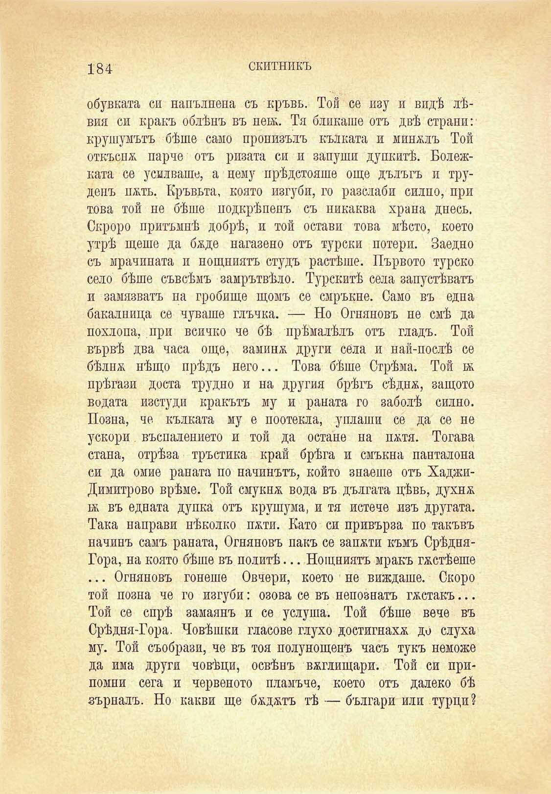

184

СКИТНИКЪ

обувката си напълнена съ кръвь. Той се изу и видѣ лѣвия си кракъ облѣнъ въ пеж. Тя бликаше отъ двѣ страни: крушумътъ бѣше само пропизълъ кълката и миналъ Той откъспж парче отъ ризата си и запуши дупкитѣ. Болежката се усилваше, а нему прѣдстояше още дълъгъ и труденъ патъ. Кръвьта, която изгуби, го разслаби силно, при това той не бѣше подкрѣпенъ съ никаква храна днесъ. Скроро притъмнѣ добрѣ, и той остави това мѣсто, което утрѣ щеше да баде нагазено отъ турски потери. Заедно съ мрачината и нощниятъ студъ растѣше. Първото турско село бѣше съвсѣмъ замрътвѣло. Турскитѣ села запустяватъ и замязватъ па гробище щомъ се смръкне. Само въ една бакалница се чуваше глъчка. — Но Огняновъ не смѣ да похлопа, при всичко че бѣ прѣмалѣлъ отъ гладъ. Той вървѣ два часа още, заминж други села и най-послѣ се бѣлнж нѣщо прѣдъ него... Това бѣше Стрѣма. Той ж прѣгази доста трудно и на другия брѣгъ сѣднж, защото водата изстуди кракътъ му и раната го заболѣ силно. Позна, че кълката му е поотекла, уплаши се да се не ускори въспалението и той да остане на пжтя. Тогава стана, отрѣза тръстика край брѣга и смъкна панталона си да омие раната по начинътъ, който знаеше отъ ХаджиДимитрово врѣме. Той смукна вода въ дългата цѣвь, духнж. ьь въ едната дупка отъ крушума, и тя истече изъ другата. Така направи нѣколко пжти. Като си привърза по такъвъ начинъ самъ раната, Огняновъ пакъ се запоти къмъ СрѣдняГора, на която бѣше въ политѣ... Нощниятъ мракъ гѫстѣеше ... Огняновъ гонеше Овчери, което не виждаше. Скоро той позна че го изгуби: озова се въ непознатъ гѫстакъ... Той се спрѣ замаянъ и се услуша. Той бѣше вече въ Срѣдня-Гора. Човѣшки гласове глухо достигнаха до слуха му. Той съобрази, че въ тоя полунощенъ часъ тукъ неможе да има други човѣци, освѣнъ вѫглищари. Той си припомни сега и червеното пламъче, което отъ далеко бѣ зърналъ. Но какви ще бжджтъ тѣ — българи или турци?

