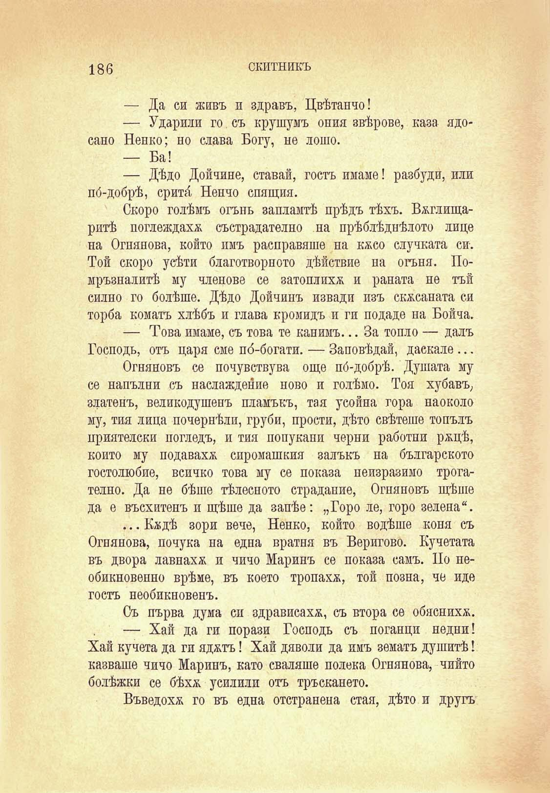

186

скитникъ

— Да си живъ и здравъ, Цвѣтанчо!

— Ударний го съ крушумъ ония звѣрове, каза ядосано Ненко; но слава Богу, не лошо.

— Ба!

— Дѣдо Дойчине, ставай, гостъ имаме! разбуди, или пб-добрѣ, сритй Ненчо спящия.

Скоро голѣмъ огънь запламтѣ прѣдъ тѣхъ. Вжглищаритѣ поглеждаха състрадателно на прѣблѣднѣлото лице на Огнянова, който имъ расправяше на кхсо случката си. Той скоро усѣти благотворното дѣйствие на огъня. Помръзналитѣ му членове се затоплихѫ и раната не тъй силно го бодѣше. Дѣдо Дойчинъ извади изъ скѫсаната си торба коматъ хлѣбъ и глава кромидъ и ги подаде на Бойча.

— Това имаме, съ това те канимъ... За топло — далъ Господь, отъ царя сме по́-богати. — Заповѣдай, даскале ...

Огняновъ се почувствува още по́-добрѣ. Душата му се напълни съ наслаждение ново и голѣмо. Тоя хубавъ, златенъ, великодушенъ пламъкъ, тая усойна гора наоколо му, тия лица почернѣли, груби, прости, дѣто свѣтеше топълъ приятелски погледъ, и тия попукани черни работни р^цѣ, който му подаваха сиромашкия залъкъ на българското гостолюбие, всичко това му се показа неизразимо трогателно. Да пе бѣше тѣлесното страдание, Огняновъ щѣше да е въсхитенъ и щѣше да запѣе: „Горо ле, горо зелена“.

... Кхдѣ зори вече, Ненко, който водѣше коня съ Огнянова, почука на една вратня въ Веригово. Кучетата въ двора лавнахх и чичо Маринъ се показа самъ. По необикновенно врѣме, въ което тропахж, той позна, че иде гостъ необикновенъ.

Съ първа дума си здрависаха, съ втора се обясниха.

— Хай да ги порази Господь съ поганци недни! Хай кучета да ги яджтъ! Хай дяволи да имъ зематъ душитѣ! казваше чичо Маринъ, като сваляше полека Огнянова, чийто болѣжки се бѣхѫ усилили отъ тръскането.

Въведохж го въ една отстранена стая, дѣто и другъ

