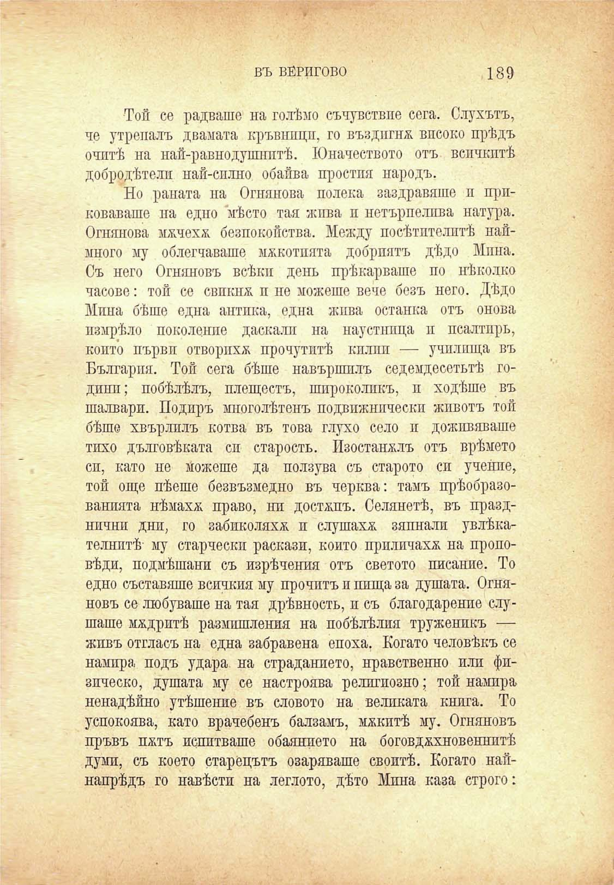

въ веригово	189

Той се радваше на голѣмо съчувствие сега. Слухътъ, че утрепалъ двамата кръвници, го въздигна високо прѣдъ очитѣ на най-равнодушнитѣ. Юначеството отъ всичкитѣ добродѣтелп най-сплно обайва простия народъ.

Но раната на Огнянова полека заздравяше и приковаваше па едно мѣсто тая жива и нетърпелива натура. Огнянова мъчехж. безпокойства. Между посѣтптелптѣ наймного му облегчаваше мжкотпята добриятъ дѣдо Мина. Съ него Огняновъ всѣки день прѣкарваше по нѣколко часове: той се свпкнъ и не можеше вече безъ него. Дѣдо Мина бѣше една антика, една жива останка отъ онова измрѣло поколение даскали на наустница и псалтиръ, който първи отворихъ прочутитѣ килии — училища въ България. Той сега бѣше навършилъ седемдесетьтѣ години ; побѣлѣлъ, плещестъ, широколикъ, и ходѣше въ шалвари. Подиръ многолѣтенъ подвпжнпческп животъ той бѣше хвърлилъ котва въ това глухо село и доживяваше тихо дълговѣката си старость. Изостаналъ отъ врѣмето сп, като не можеше да ползува съ старото си учение, той още пѣеше безвъзмедно въ черква: тамъ прѣобразованията нѣмаха право, ни достѫпъ. Селянетѣ, въ праздничнп дни, го забиколяхж и слушахъ зяпнали увлѣкателнитѣ- му старчески раскази, който приличаха на проповѣди, подмѣшани съ изрѣчения отъ светото писание. То едно съставяше всичкия му прочитъ и пища за душата. Огняновъ се любуваше на тая дрѣвность, и съ благодарение слушаше мѫдритѣ размишления на иобѣлѣлия труженикъ — живъ отгласъ на една забравена епоха. Когато человѣкъ се намира подъ удара на страданието, нравственно или физическо, душата му се настройва религиозно; той намира ненадѣйно утѣшение въ словото на великата книга. То успокоява, като врачебенъ балзамъ, мъкитѣ му. Огняновъ пръвъ пътъ попитваше обаянието на боговдъхновенитѣ думи, съ което старецътъ озаряваше своитѣ. Когато найнапрѣдъ го навѣсти на леглото, дѣто Мина каза строго:

