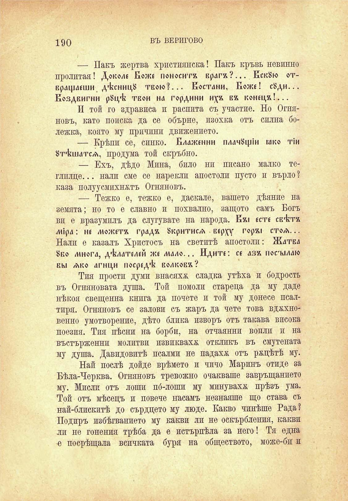

190

ВЪ ВЕРИГОВО

— Пакъ жертва християнска! Пакъ кръвь невинно пролитай! Доколс Боже поносите врага?... ЕскЗю отврдфаеши дѣкницЗ твою?... Еостани, Боже! с8ди... Еоздвигни рЗщк твои на гордини ва конеца!...

И той го здрависа и распита съ участие. Но Огняновъ, като поиска да се обърне, изохка отъ силна болежка, която му причини движението.

— Крѣпи се, синко. Блаженни плачещи гако т!и Ятѣшатсж, продума той скръбно.

— Ехъ, дѣдо Мина, било ни писано малко теглплце... нали сме се нарекли апостоли пусто и върло ? каза полуусмихнктъ Огняновъ.

— Тежко е, тежко е, даскале, вашето дѣяние на земята; но то е славно и похвално, защото самъ Богъ ви е вразумилъ да слугувате на народа. Ех1 есте св^тх лйрд: не можете града Зкритисд вер\у гора! стоа. .. Нали е казалъ Христосъ на светитѣ апостоли: Ждтвд 8во Л1Н0ГЛ, д^лателей же мал©... Идите: се аза посъмдк вь1 ако агнци посред^ волкова?

Тия прости думи внасяха сладка утѣха и бодрость въ Огняновата душа. Той помоли стареца да му даде нѣкоя свещенна книга да почете и той му донесе псалтиря. Огняновъ се залови съ жаръ да чете това вдххновенно умотворение, дѣто блика изворъ отъ такава висока поезия. Тия пѣсни на борби, на отчаяний вопли и на въстърженни молитви извикваха откликъ въ смутената му душа. Давидовитѣ псалми не падаха отъ ржцѣтѣ му.

Най послѣ дойде врѣмето и чичо Маринъ отиде за Бѣла-Черква. Огняновъ тревожно очакваше завръщанието му. Мисли отъ лоши по́-лоши му минувахх прѣзъ ума. Той отъ мѣсецъ и повече насамъ незнаяше що става съ най-блискитѣ до сърдцето му люде. Какво чинѣше Рада? Подиръ избѣгванието му какви ли не оскърбления, какви ли не гонения трѣба да е истърпѣла за него! Тя една •е посрѣщала всичката буря на обществото, може-би и

