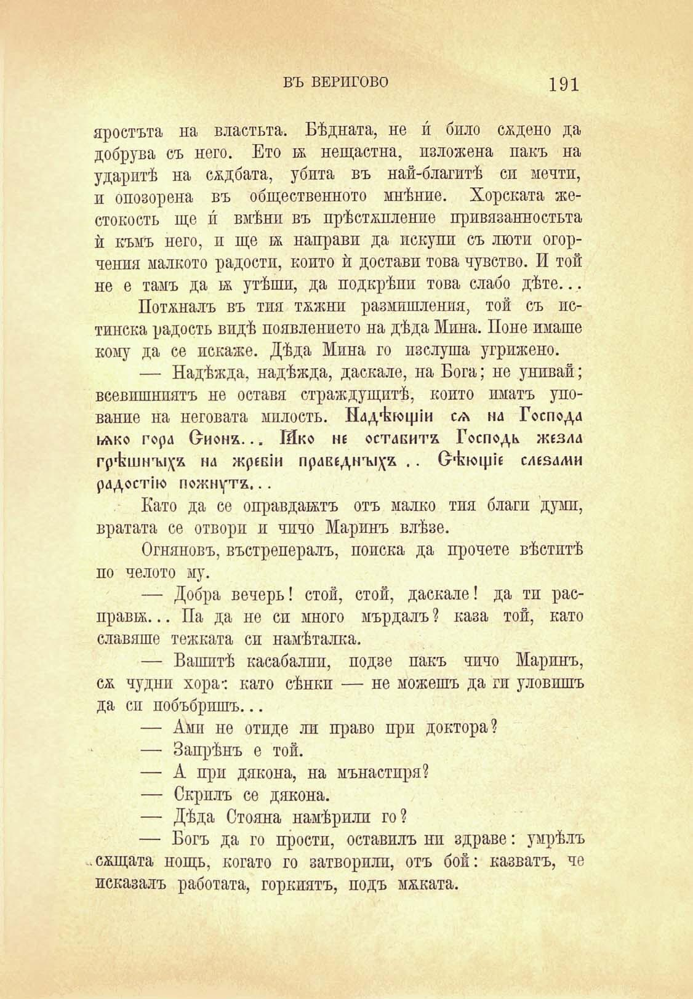

ВЪ ВЕРИГОВО

191

яростьта на властьта. Бѣдната, не и́ било сждено да добрува съ него. Ето я нещастна, изложена пакъ на ударитѣ на сѫдбата, убита въ най-благитѣ си мечти, и опозорена въ общественното мнѣнпе. Хорската жестокость ще и́ вмѣни въ прѣстѫпление привязанностьта ѝ къмъ иего, и ще я направи да пскупп съ люти огорченпя малкото радости, който ѝ достави това чувство. И той не е тамъ да я утѣши, да подкрѣпи това слабо дѣте...

Потъналъ въ тия тжжнп размишления, той съ истинска радость видѣ появлението на дѣда Мина. Поне имаше кому да се покаже. Дѣда Мина го изслуша угрижено.

— Надѣжда. надѣжда, даскале, на Бога; не унивай; всевишниятъ не оставя страждущптѣ, конто иматъ упованпе на неговата милость. Нддѣюцѝи сѫ на Господа како гора Оиона... 1Йко не оставите Господь жезаа гр'кшнъ1Х& на жревш праведний .. и саезами радостно пожнутъ...

Като да се оправдаятъ отъ малко тпя благп думп, вратата се отвори и чичо Маринъ влѣзе.

Огняновъ, въстрепералъ, попска да прочете вѣститѣ по челото му.

— Добра вечерь! стой, стой, даскале! да тп расправя... Па да не си много мърдалъ ? каза той, като славяше тежката си намѣталка.

— Вашитѣ касабалии, подзе пакъ чичо Маринъ, сж чудни хора-: като сѣнки — не можешъ да ги уловишъ да си побъбришъ...

— Ами не отиде ли право при доктора?

— Запрѣнъ е той.

— А при дякона, на мънастиря?

— Скрилъ се дякона.

— Дѣда Стояна намѣрплп го?

— Богъ да го прости, оставилъ ни здраве: умрѣлъ сжщата нощь, когато го затворпли, отъ бой: казватъ, че исказалъ работата, горкиятъ, подъ мжката.

