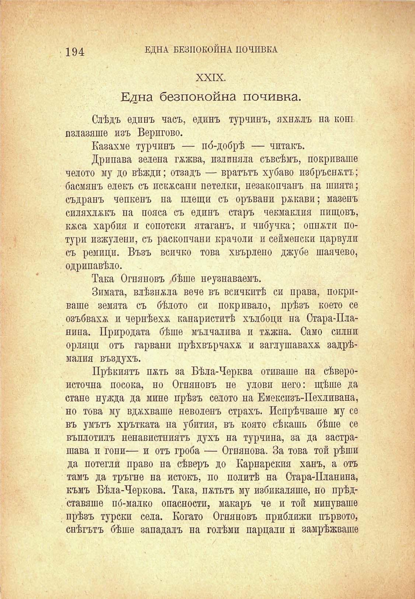

194	ЕДНА БЕЗПОКОЙНА ПОЧИВКА

XXIX.

Една безпокойна почивка.

Слѣдъ единъ часъ, единъ турчинъ, яхналъ на кош излавяше изъ Верпгово.

Казахме турчинъ — по́-добрѣ — читакъ.

Дрипава зелена гжжва, изливала съвсѣмъ, покриваше челото му до вѣжди; отзадъ — вратътъ хубаво избръснатъ; басмянъ елекъ съ некусани петелки, незакопчанъ па шията; съдранъ чепкенъ па плещи съ оръвани рѫкави; мазенъ силяхлжкъ па пояса съ единъ старъ чекмаклия пищовъ, кжса харбия и сопотски ятаганъ, и чибучка; опн&ти потури изжулени, съ раскопчани крачоли и сейменски царвули съ ремпци. Възъ всичко това хвърлеио джубе шаячево, одрипавѣло.

Така Огняновъ бѣше неузнаваемъ.

Зимата, влѣзнжла вече въ всичкитѣ си права, покриваше земята съ бѣлото си покривало, прѣзъ което се озъбвахж. и чернѣеха канариститѣ хълбоци на Стара-Планипа. Природата бѣше мълчалива и тжжна. Само силни орляци отъ гарвани прѣхвърчаха и заглушаваха задрѣмалия въздухъ.

Прѣкиятъ пжть за Бѣла-Черква отиваше на сѣвероисточна посока, но Огняновъ не улови него: щѣше да стане нужда да мине прѣзъ селото на Емексизъ-Пехливана, но това му вдухваше неволенъ страхъ. Испрѣчваше му се въ умътъ хрътката на убития, въ която сѣкашь бѣше се въплотилъ ненавистниятъ духъ на турчина, за да застрашава и гони— и отъ гроба — Огнянова. За това той рѣши да потегли право на сѣверъ до Карнарския ханъ, а отъ тамъ да тръгне на истокъ, по политѣ на Стара-Планина, къмъ Бѣла-Черкова. Така, пѫтьтъ му избикаляше, но прѣдставяше по́-малко опасности, макаръ че и той минуваше прѣзъ турски села. Когато Огняновъ приближи първото, снѣгътъ бѣше западалъ на голѣми парцали и замрѣжваше

