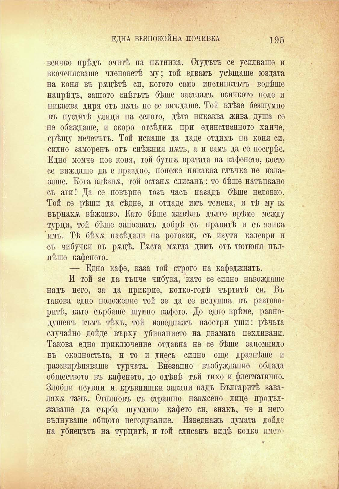

ЕДНА БЕЗПОКОЙНА ПОЧИВКА

195

всичко прѣдъ очитѣ на пжтнпка. Студътъ се усилваше и вкоченясваше членоветѣ му; той едвамъ усѣщаше юздата на коня въ рѫцѣтѣ си, когото само инстинктътъ водѣше напрѣдъ, защото снѣгътъ бѣше застлалъ всичкото поле и никаква диря отъ пжть не се виждаше. Той влѣзе безшумно въ пуститѣ улици на селото, дѣто никаква жива душа се не обаждаше, и скоро отсѣдна при единственното ханче, срѣщу мечетътъ. Той искаше да даде отдихъ на коня си, силно заморенъ отъ снѣжния п&ть, а и самъ да се посгрѣе. Едно момче пое коня, той бутнж вратата на кафенето, което се виждаше да е праздно, понеже никаква глъчка не излавяше. Кога влѣзнж, той остана слисанъ: то бѣше натъпкапо съ аги! Да се повърне тозъ часъ назадъ бѣше неловко. Той се рѣши да сѣдне, и отдаде имъ темена, и тѣ му ж върнаха вѣжливо. Като бѣше живѣлъ дълго врѣме между турци, той бѣше запознатъ добрѣ съ нравитѣ и съ язика имъ. Тѣ бѣхѫ насѣдали на рогозки, съ изути калеври и съ чибучки въ ржцѣ. Гжста мжгла димъ отъ тютюни пълнѣше кафенето.

— Едно кафе, каза той строго па кафеджиятъ.

И той зе да тъпче чибука, като се силно навеждаше надъ него, за да прикрие, колко-годѣ чъртитѣ си. Въ такова едно положение той зе да се вслушва въ разговоритѣ, като сърбаше шумно кафето. До едно врѣме, равнодушенъ къмъ тѣхъ, той изведнажъ наостри уши: рѣчьта случайно дойде върху убивапието на двамата пехливани. Такова едно приключение отдавна не се бѣше запомнило въ околностьта, и то и дпесь силно още дразнѣше и разсвирѣпяваше турната. Внезапно възбужданий облада обществото въ кафенето, до одѣвѣ тъй тихо и флегматично. Злобни псувни и кръвнишки закани надъ Българитѣ заваляхж тамъ. Огняновъ съ страшно навѫсено лице продължаваше да сърба шумливо кафето си, знакъ, че и него вълнуваше общото негодувание. Изведнажь думата дойде на убиецътъ на турцитѣ, и той слисанъ видѣ колко името

