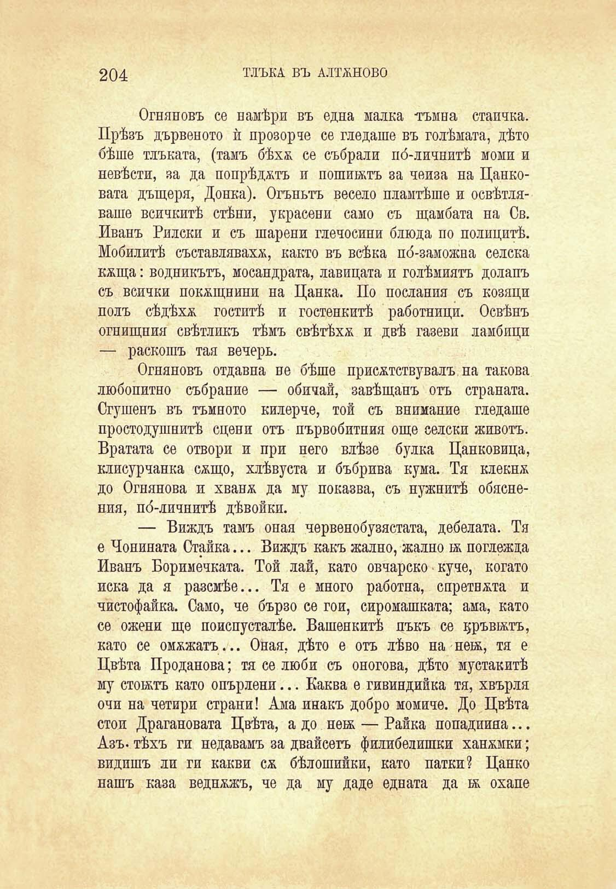

204

ТЛЪКА ВЪ АЛТЖНОВО

Огняновъ се намѣри въ една малка тъмна стаичка. Прѣзъ дървеното ѝ прозорче се гледаше въ голѣмата, дѣто бѣше тлъката, (тамъ бѣхѫ се събрали по́-личнитѣ моми и невѣсти, за да попрѣджтъ и пошибктъ за чеиза на Цанковата дъщеря, Донка). Огъньтъ весело пламтѣше и освѣтляваше всичкитѣ стѣни, украсени само съ щамбата на Св. Иванъ Рилски и съ шарени глечосини блюда по полицитѣ. Мобилитѣ съставляваха, както въ всѣка по́-заможна селска кжща: водникътъ, мосандрата, лавицата и голѣмиятъ долапъ съ всички покѫщнини на Цанка. По послания съ козяци полъ сѣдѣха гоститѣ и гостенкитѣ работници. Освѣнъ огнищния свѣтликъ тѣмъ свѣтѣха и двѣ газеви ламбици — раскошъ тая вечерь.

Огняновъ отдавна не бѣше присѫствувалъ на такова любопитно събрание — обичай, завѣщанъ отъ страната. Сгушенъ въ тъмното килерче, той съ внимание гледаше простодушнитѣ сцени отъ първобитния още селски животъ. Вратата се отвори и при него влѣзе булка Цанковица, клисурчанка сжщо, хлѣвуста и бъбрива кума. Тя клекна до Огнянова и хванж да му показва, съ нужнитѣ обяснения, по́-личнитѣ дѣвойки.

— Виждъ тамъ оная червенобузястата, дебелата. Тя е Чонината Стайна... Виждъ какъ жално, жално ьь поглежда Иванъ Боримечката. Той лай, като овчарско • куче, когато иска да я разсмѣе... Тя е много работна, спретната и чистофайка. Само, че бързо се гои, сиромашката; ама, като се ожени ще поиспусталѣе. Вашенкитѣ пъкъ се дръвньтъ, като се омажатъ... Оная, дѣто е отъ лѣво на неж, тя е Цвѣта Проданова; тя се люби съ оногова, дѣто мустакитѣ му стонътъ като опърлени... Каква е гивиндийка тя, хвърля очи на четири страни! Ама инакъ добро момиче. До Цвѣта стои Драгановата Цвѣта, а до неѭ — Райка попадиина... Азъ. тѣхъ ги недавамъ за двайсеть филибелишки ханъмки; видишъ ли ги какви сѫ бѣлошийки, като патки? Цанко нашъ каза веднжжъ, че да му даде едната да бб охапе

