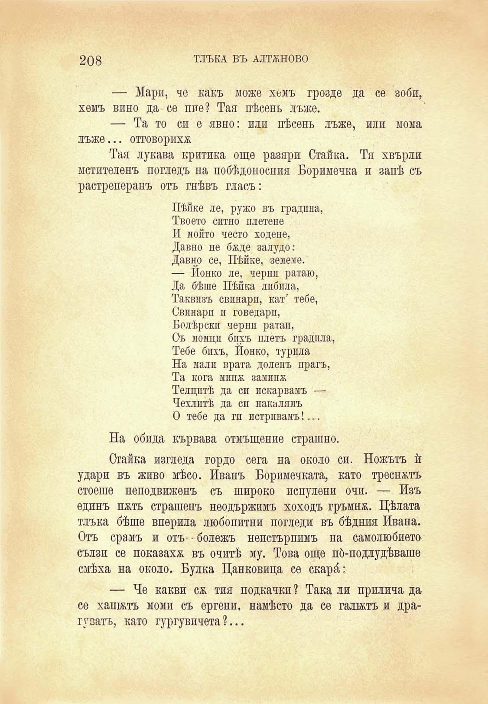

208

ТЛЪКА ВЪ АЛТЖНОВО

— Мари, че какъ може хемъ грозде да се зоби, хемъ вино да се пие? Тая пѣсень лъже.

— Та то си е явно: пли пѣсень лъже, или мома лъже... отговориха

Тая лукава критика още разяри Стайна. Тя хвърли мстителепъ погледъ на побѣдоносиия Боримечка и запѣ съ растреперанъ отъ гнѣвъ гласъ:

Пѣйке ле, ружо въ градина, Твоето ситно плетене И мойто често ходене, Давпо не бѫде залудо: Давно се, Пѣйке, земеме. — Йонко ле, черни ратаю, Да бѣше Пѣйка лпбпла, Таквпзъ свинари, кат’ тебе, Свинари и говедари, Болѣрски черни ратаи, Съ момци бихъ плетъ градпла, Тебе бихъ, Йонко, турпла На малп врата доленъ прагъ, Та кога мпнж вампнж Телцитѣ да си покарвамъ — Чехлитѣ да си накалямъ О тебе да ги потривамъ!...

На обпда кървава отмъщение страшно.

Стайна изгледа гордо сега на около си. Ножътъ ѝ удари въ живо мѣсо. Иванъ Боримечката, като треснхтъ стоеше неподвиженъ съ широко испулени очи. — Изъ единъ пжть страшенъ неодържимъ хоходъ гръмна. Цѣлата тлъка бѣше вперила любопитни погледи въ бѣдния Ивана. Отъ срамъ и отъ- • бодежъ неистърппмъ на самолюбието сълзи се показаха въ очитѣ му. Това още по́-подлудѣваше смѣха на около. Булка Цанковица се скарай

— Че какви с& тия подканки ? Така ли прилича да се хапътъ моми съ ергени, намѣсто да се галжтъ и драгузатъ, като гургувичета?...

