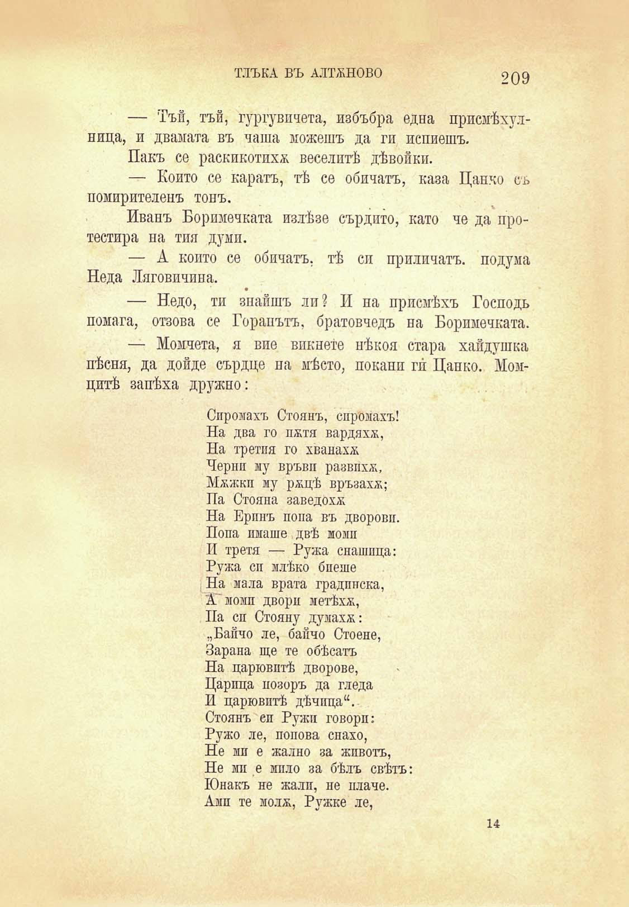

ТЛЪКА ВЪ АЛТЖНОВО

209

— Тъй, тъй, гургувпчета, избъбря една присмѣхулница, и двамата въ чаша можешъ да ги попиешъ.

Пакъ се раскикотпхж. веселитѣ дѣвойки.

— Който се каратъ, тѣ се обичатъ, каза Цанко съ помирителенъ тонъ.

Иванъ Боримечката излѣзе сърдито, като че да протестира на тия думи.

— А конто се обичатъ, тѣ си приличатъ, подума Неда Ляговичпна.

— Недо, ти зпайшъ ли? И па присмѣхъ Господь помага, отзова се Горапътъ, братовчедъ па Боримечката.

— Момчета, я вие викнете нѣкоя стара хайдушка пѣсни, да дойде сърдце на мѣсто, покапи гѝ Цанко. Момцитѣ запѣха дружно:

Сиромахъ Стоянъ, сиромахъ! На два го па;тя вардяхж, На третия го хванаха; Черпи му връвп развиха;, Мжжкп му ращѣ връзахм; Па Стояла заведоха;

На Ерпнъ попа въ дворовп. Попа имаше двѣ моми II третя — Ружа снашпца: Ружа си млѣко биеше На мала врата градинска, А моми двори метѣха;, Па си Стояну думаха;: „Байчо ле, байчо Стоене, Барана ще те обѣсатъ На царювптѣ дворове, Царица позоръ да гледа И царювптѣ дѣчпца“. Стоянъ си Ружи говори: Ружо ле, полова спахо, Не мп е жално за животъ, Не мп е мило за бѣлъ свѣтъ: Юнакъ не жали, не плаче. Амп те мола;, Ружке ле,

14

