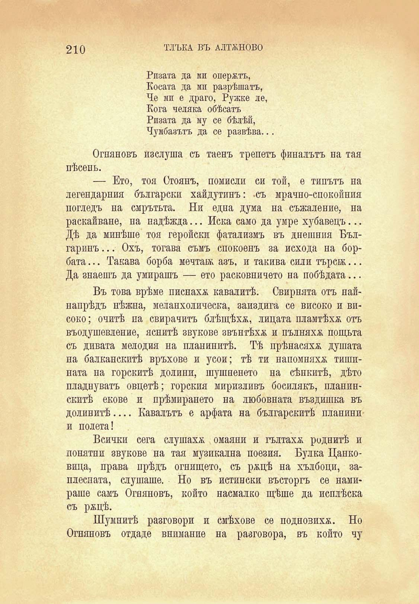

210

ТЛЪКА ВЪ АЛТЖНОВО

Ризата да мп оперятъ, Косата да ми разрѣшатъ, Че мп е драго, Ружке ле, Кога челика обѣсатъ Ризата да му се бѣлѣй, Чумбазътъ да се развѣва...

Огпяновъ изслуша съ таенъ трепетъ финалътъ на тая пѣсень.

— Ето, тоя Стоянъ, помисли си той, е типътъ на легендарния български хайдутинъ: «съ мрачно-спокойния погледъ на смрътьта. Ни една дума на съжаление, на раскайване, па надѣжда... Иска само да умре хубавецъ... Дѣ да минѣше тоя геройски фатализмъ въ днешния Българииъ... Охъ, тогава съмъ спокоенъ за исхода на борбата... Такава борба мечтаж азъ, и такива сили търсж... Да знаешъ да умирашъ — ето расковпичето на побѣдата...

Въ това врѣме писнаха кавалитѣ. Свирнята отъ найнапрѣдъ нѣжпа, меланхолическа, заиздига се високо и високо; очитѣ па свирачитъ блѣщѣха, лицата пламтѣха отъ въодушевление, яснитѣ звукове звънтѣха и пълняхж пощьта съ дивата мелодия на планинитѣ. Тѣ прѣнасяха душата иа балканскитѣ връхове и усои; тѣ ти напомняха тишината на горскитѣ долини, шушненето на сѣнкитѣ, дѣто пладнуватъ овцетѣ; горския миризливъ босилякъ, планинскитѣ екове и прѣмирането на любовната въздишка въ долинитѣ.... Кавалътъ е арфата на българскитѣ планини и полета!

Всички сега слушаха омаяни и гълтаха роднитѣ и понятни звукове на тая музикална поезия. Булка Цанковица, права прѣдъ огнището, съ ряцѣ на хълбоци, заплесната, слушаше. Но въ истински въсторгъ се намираше самъ Огняновъ, който насмалко щѣше да исплѣска съ ряцѣ.

Шумнитѣ разговори и смѣхове се подновиха. Но Огняновъ отдаде внимание на разговора, въ който чу

