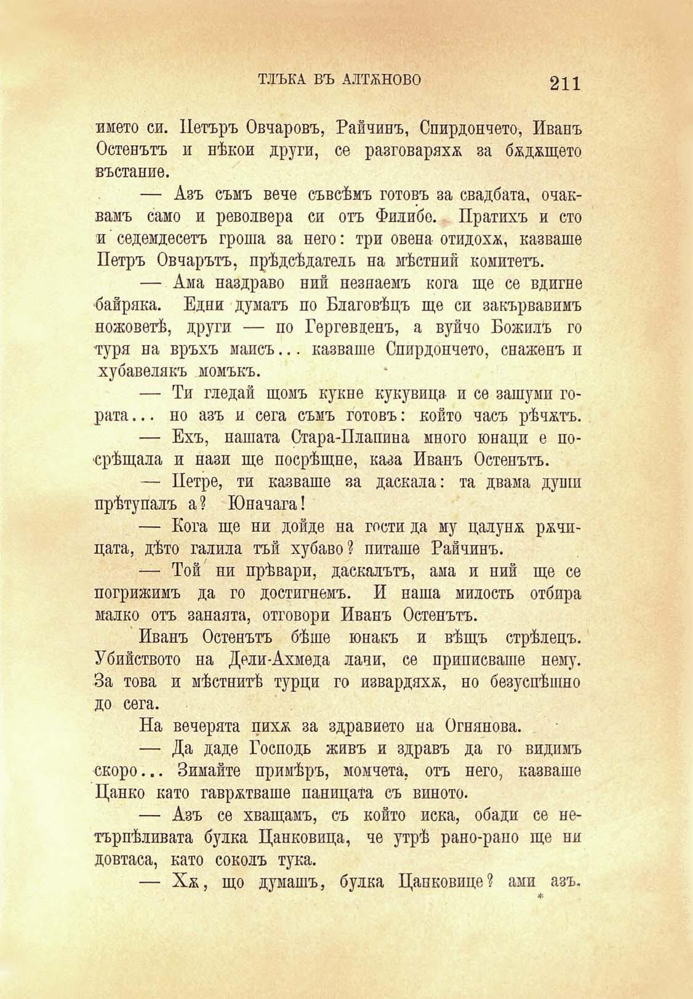

ТЛЪКА ВЪ АЛТЖНОВО

211

името си. Петъръ Овчаровъ, Райчинъ, Спирдончето, Иванъ Остенътъ и нѣкои други, се разговаряха за бвджщето въстание.

— Азъ съмъ вече съвсѣмъ готовъ за свадбата, очаквамъ само и револвера си отъ Филибе. Пратихъ и сто и ’ седемдесеть гроша за него: три овена отидоха, казваше Петръ Овчарьтъ, прѣдсѣдатель на мѣстний комитетъ.

— Ама наздраво ний незнаенъ кога ще се вдигне байрака. Едни думатъ по Благовѣцъ ще си закървавимъ ножоветѣ, други — по Гергевденъ, а вуйчо Божилъ го туря на връхъ маисъ... казваше Спирдончето, снаженъ п хубавелякъ момъкъ.

— Ти гледай щомъ куки е кукувица и се зашуми гората... но азъ и сега съмъ готовъ: който часъ рѣчжтъ.

— Ехъ, нашата Стара-Плапина много юнаци е посрѣщала и нази ще посрѣщне, каза Иванъ Остенътъ.

— Петре, ти казваше за даскала: та двама души прѣтупалъ а? Юначага!

— Кога ще ни дойде на гости да му цалунж ржчицата, дѣто галила тъй хубаво? питаше Райчинъ.

— Той ни прѣвари, даскалътъ, ама и ний ще се погрижимъ да го достигнемъ. И наша милость отбира малко отъ занаята, отговори Иванъ Остенътъ.

Иванъ Остенътъ бѣше юнакъ и вѣщъ стрѣлецъ. Убийството на Дели-Ахмеда лачи, се приписваше нему. За това и мѣстнитѣ турци го извардиха, но безуспѣшно до сега.

На вечерята пихѫ за здравието на Огнянова.

— Да даде Господь живъ и здравъ да го видпмъ скоро... Зимайте примѣръ, момчета, отъ него, казваше Цанко като гавратваше паницата съ виното.

— Азъ се хващамъ, съ който иска, обади се нетърпѣливата булка Цанковица, че утрѣ рано-рано ще ни довтаса, като соколъ тука.

— Хж, що думашъ, булка Цанковице? ами азъ.

