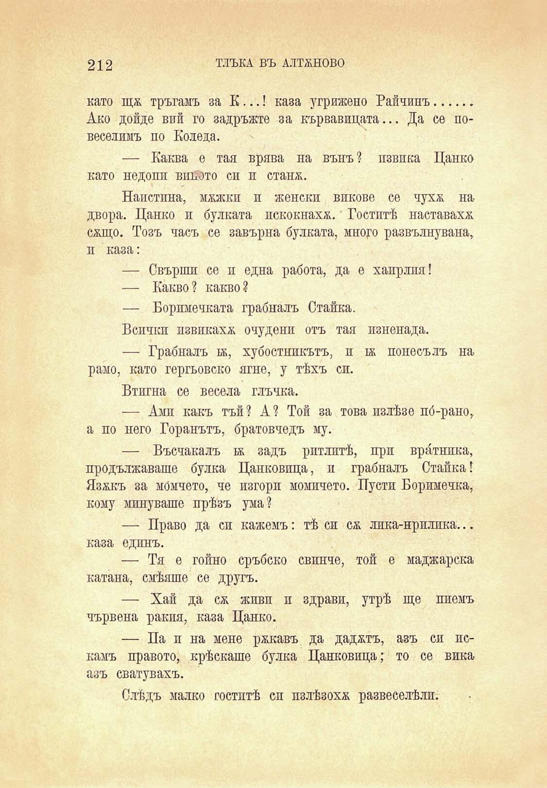

212

ТЛЪКА ВЪ АЛТЖНОВО

като щя тръгамъ за К...! каза угрижено Райчинъ......... Ако дойде вий го задръжте за кървавицата... Да се повеселимъ по Коледа.

— Каква е тая врява на вънъ? извика Цанко като недопп виното си и стапя.

Наистина, мяжки и женски викове се чухя на двора. Цанко и булката искокнахя. Гоститѣ наставахя сящо. Тозъ часъ се завърна булката, много развълнувана, п каза:

— Свърши се и една работа, да е хаирлия!

— Какво ? какво ?

— Боримечката грабналъ Станка.

Бспчкп пзвпкахя очудени отъ тая изненада.

— Грабналъ к, хубостникътъ, н 1Я понесълъ на рамо, като гергьовско ягне, у тѣхъ си.

Втигна се весела глъчка.

— Ами какъ тъй? А? Той за това излѣзе нб-рано, а по него Горанътъ, братовчедъ му.

— Въсчакалъ тя задъ ритлитѣ, при вратника, продължаваше булка Цанковица, и грабналъ Станка! Язякъ за момчето, че изгори момичето. Пусти Боримечка, кому минуваше прѣзъ ума?

— Право да си кажемъ: тѣ си ся лпка-нрплпка... каза единъ.

— Тя е говно сръбско свинче, той е маджарска катана, смѣяше се другъ.

— Хай да ся живи и здрави, утрѣ ще пиемъ чървена ракия, каза Цанко.

— Па и на мене рякавъ да дадятъ, азъ си искамъ правото, крѣскаше булка Цанковица; то се вика азъ сватувахъ.

Слѣдъ малко гоститѣ си пзлѣзохя развеселѣли.

