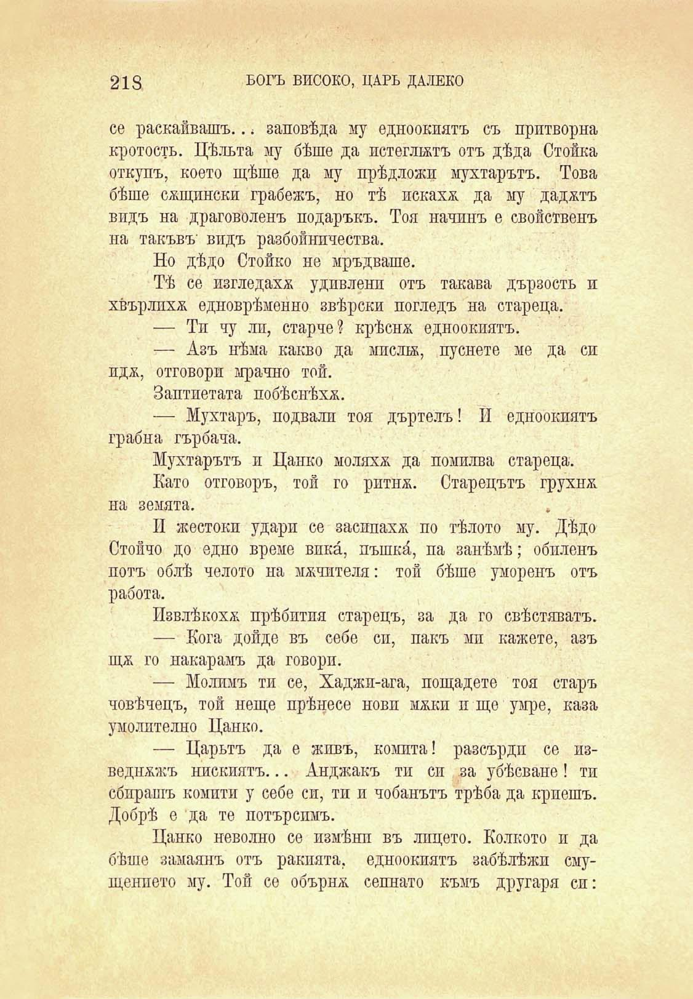

218	БОГЪ ВИСОКО, ЦАРЬ ДАЛЕКО

се раскайвашъ.. ; заповѣда му едноокиятъ съ притворна кротость. Цѣльта му бѣше да потеглятъ отъ дѣда Стойка откупъ, което щѣше да му прѣдложи мухтарътъ. Това бѣше сѫщински грабежъ, но тѣ искаха да му дадатъ видъ на драговоленъ подаръкъ. Тоя начинъ е свойственъ на такъвъ’ видъ разбойничества.

Но дѣдо Стойко не мръдваше.

Тѣ се изгледаха удпвленп отъ такава дързость и хвърлпхж. едноврѣменно звѣрски погледъ на стареца.

— Ти чу лп, старче? крѣсна едноокиятъ.

— Азъ нѣма какво да мпслж, пуснете ме да си лдж, отговори мрачно той.

Заптиетата побѣснѣха.

— Мухтаръ, подвали тоя дъртелъ! И едноокиятъ грабна гърбача.

Мухтарътъ и Цанко моляхж да помилва стареца.

Като отговоръ, той го ритнж. Старецътъ грухнж. на земята.

II жестоки удари се засипаха по тѣлото му. Дѣдо Стойчо до едно време вика, пъшкй, па занѣмѣ; обпленъ потъ облѣ челото па мѫчителя: той бѣше уморенъ отъ работа.

Извлѣкохѫ прѣбптпя старецъ, за да го свѣстяватъ.

— Кога дойде въ себе сп, пакъ мп кажете, азъ щж го накарамъ да говори.

— Молимъ ти се, Хаджп-ага, пощадете тоя старъ човѣчецъ, той неще прѣнесе новп мжки и ще умре, каза умолително Цанко.

— Царьтъ да е жпвъ, комита! разсърди се изведн&жъ нискиятъ... Анджакъ тп си за убѣсване! тп сбирашъ комити у себе сп, ти и чобанътъ трѣба да криешъ. Добрѣ е да те потърсимъ.

Цанко неволно се измѣни въ лицето. Колкото и да бѣше замаянъ отъ ракията, едноокиятъ забѣлѣжи смущението му. Той се обърна сепнато къмъ другаря сп:

