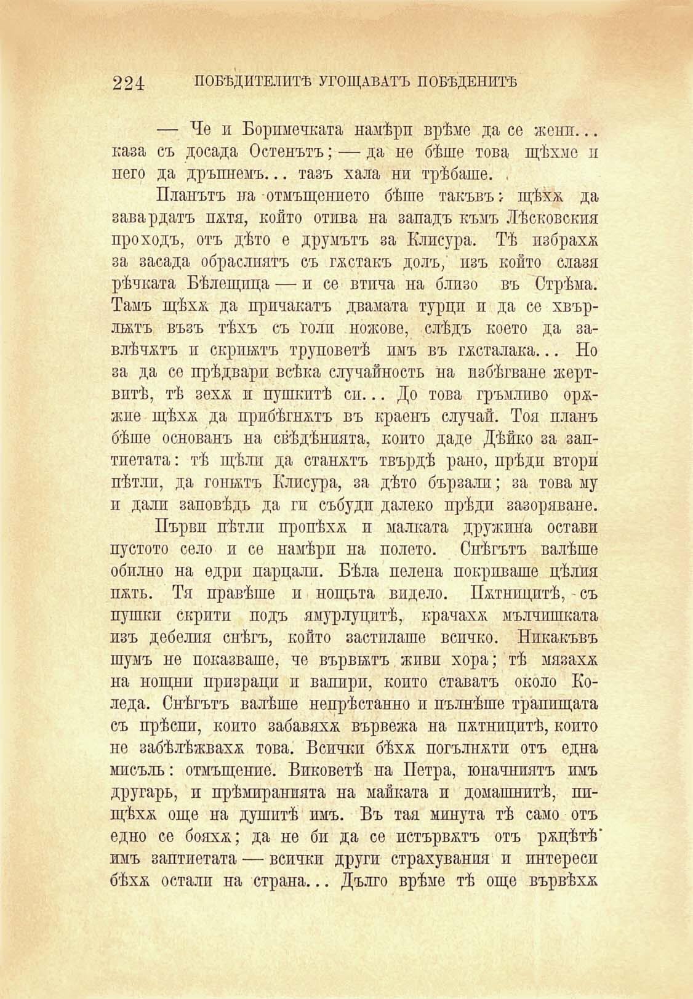

224 ПОБѢДИТЕЛИТѢ УГОЩАВАТЪ ПОБЕДЕНИТѢ

— Че и Боримечката намѣри врѣме да се жени... каза съ досада Остенътъ; — да не бѣше това щѣхме и него да дръпнемъ... тазъ хала ни трѣбаше. .

Планътъ на отмъщението бѣше такъвъ > щѣха; да завардатъ пуля, който отива на западъ къмъ Лѣсковскпя проходъ, отъ дѣто е друмътъ за Клисура. Тѣ избраха за засада обраслиятъ съ гѫстакъ долъ, изъ който слазя рѣчната Бѣлещпца — и се втича на близо въ Стрѣма. Тамъ щѣхж. да причакатъ двамата турци и да се хвърлектъ възъ тѣхъ съ голи ножове, слѣдъ което да завлѣчалъ и скриптъ труповетѣ пмъ въ гѫсталака... Но за да се прѣдвари всѣка случайность на избѣгване жертвитѣ, тѣ зехж н пушкптѣ си... До това гръмливо оржжпе щѣхѫ да прибѣгналъ въ краенъ случай. Тоя планъ бѣше основанъ на свѣдѣнпята, копто даде Дѣйко за заптиетата : тѣ щѣли да станалъ твърдѣ рано, прѣди втори пѣтли, да гонилъ Клисура, за дѣто бързали; за това му п дали заповѣдь да ги събуди далеко прѣди зазоряване.

Първи пѣтлп пропѣха, и малката дружина остави пустото село и се намѣри на полето. Снѣгътъ валѣше обилно на едри парцали. Бѣла пелена покриваше цѣлия паль. Тя правѣше и нощьта видело. Потницитѣ, - съ пушки скрити подъ ямурлуцитѣ, крачахж мълчишката изъ дебелия снѣгъ, който застилаше всичко. Никакъвъ шумъ не показваше, че вървилъ жпвп хора; тѣ мязаха на нощни призраци и вапирп, копто ставатъ около Коледа. Снѣгътъ валѣше непрѣстанно и пълнѣше трапшцата съ прѣспи, копто забавяха вървежа на потницитѣ, копто не забѣлѣжвахж това. Всички бѣхѫ погълнали отъ една мисъль: отмъщение. Виковетѣ на Петра, юначниятъ имъ другарь, и прѣмиранията на майката и домашнитѣ, пищѣха още на душитѣ имъ. Въ тая минута тѣ само отъ едно се бояхж; да не би да се истървалъ отъ ращѣтѣ’ имъ заптиетата — всички други страхувания и интереси бѣхѫ остали на страна... Дълго врѣме тѣ още вървѣха;

