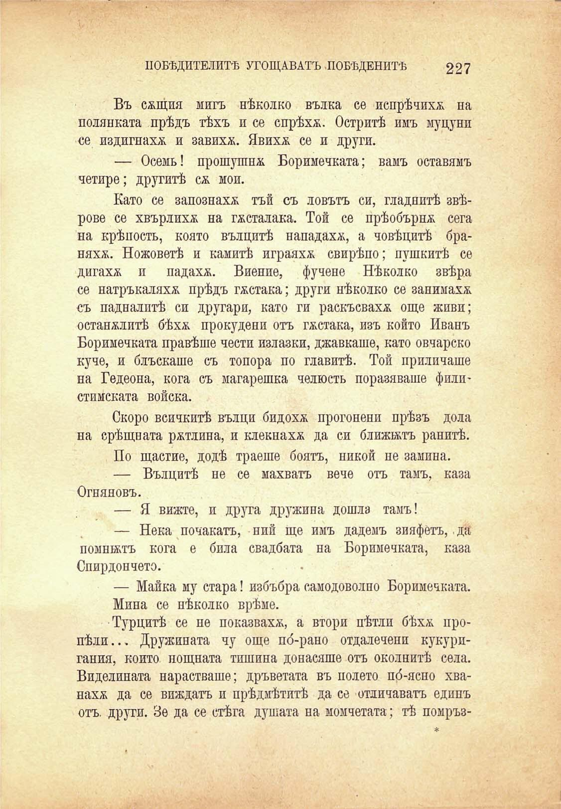

ПОБѢДИТЕЛИТѢ УГОЩАВАТЪ ЛОБѢДЕНИТѢ

227

Въ сащия мигъ нѣколко вълка се попрѣчихѫ на полянката прѣдъ тѣхъ и се спрѣха. Остритѣ имъ муцуни се издигнаха и завихА. Явихѫ се и други.

— Осемь! прошушна Боримечката; вамъ оставямъ четире; другитѣ са мои.

Като се запознаха тъй съ ловътъ си, гладнитѣ звѣрове се хвърлихѫ на гАсталака. Той се прѣобърнА сега на крѣпость, която вълцитѣ нападахм, а човѣцитѣ браняха. Ножоветѣ и камитѣ играяхА свирѣпо; пушкитѣ се дигахА и падахА. Виение, фучене Нѣколко звѣра се натръкаляхА прѣдъ гАстака; други нѣколко се занимахА съ падналптѣ си другари, като ги раскъсвахА още живи; останАлитѣ 6Ѣха прокудени отъ ГАстака, изъ който Иванъ Боримечката правѣше чести излазки, джавкаше, като овчарско куче, и блъскаше съ топора по главитѣ. Той приличаше на Гедеона, кога съ магарешка челюсть поразяваше филистимската войска.

Скоро всичкитѣ вълци бидохѫ прогонени прѣзъ дола на срѣщната рАтлина, и клекнахА да си ближатъ ранитѣ.

По щастие, додѣ траеше боятъ, никой не замина.

— Вълцитѣ не се махватъ вече отъ тамъ, каза Огняновъ.

— Я вижте, и друга дружина дошла тамъ!

— Нека почакатъ, ний ще имъ дадемъ зияфетъ, да помнятъ кога е била свадбата на Боримечката, каза Спирдончето.

— Майка му стара! избъбра самодоволно Боримечката.

Мина се нѣколко врѣме.

Турцитѣ се не показвахА, а втори пѣтли 6Ѣха пропѣли... Дружината чу още по́-рано отдалечени кукуригания, който нощната тишина донасяше отъ околнитѣ села. Виделината нарастваше; дръветата въ полето по́-ясно хванахА да се виждатъ и прѣдмѣтитѣ да се отличаватъ единъ отъ. други. Зе да се стѣга душата на момчетата; тѣ помръз-

