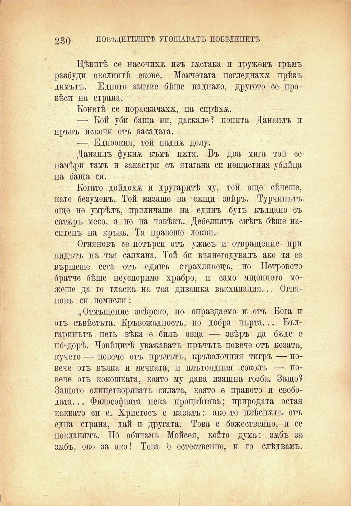

230

ПОБѢДИТЕЛИТѢ УГОЩАВАТЪ ПОБѢДЕНИТѢ

Дѣвитѣ се насочихѫ изъ гѫстака и друженъ гръмъ разбуди околнитѣ екове. Момчетата погледнаха прѣзъ димътъ. Едното заптие бѣше паднало, другото се провѣси на страна.

Конетѣ се пораскачахж, па спрѣха.

— Кой уби баща ми, даскале? попита Данаилъ п пръвъ искочи отъ засадата.

— Едноокия, той паднж долу.

Данаилъ фукня къмъ пхтя. Въ два мига той се намѣри тамъ и закастрп съ ятагана си нещастния убийца на баща си.

Когато. дойдохѫ и другаритѣ му, той още сѣчеше, като безуменъ.. Той мязаше на сящи звѣръ. Турчинътъ още не умрѣлъ, приличаше на единъ бутъ кълцано съ сатжръ месо, а не на човѣкъ. Дебелиятъ снѣгъ бѣше насптенъ на кръвь. Тя правеше локви.

Огняновъ се потърси отъ ужасъ и отвращение при видътъ на тая салхана. Той би възнегодувалъ ако тя се вършеше сега отъ едпнъ страхливецъ, но Петровото братче бѣше неуспоримо храбро, и само мщението можеше да го тласка на тая дивашка вакханалия... Огняновъ си помисли:

„Отмъщение звѣрско, но оправдаемо и отъ Бога и отъ съвѣстьта. Кръвожадность, но добра чърта... Българинътъ петь вѣка е билъ овца — звѣръ да бѫде е пб-дорѣ. Човѣцитѣ уважаватъ пръчътъ повече отъ козата, кучето — повече отъ пръчътъ, кръволочния тигръ — повече отъ вълка и мечката, и плътоядния соколъ — повече отъ кокошката, която му дава изящна гозба. Защо? Защото олицетворяватъ силата, която е правото и свободата. .. Философията нека процвѣтява; природата остая каквато си е. Христосъ е казалъ: ако те плѣснатъ отъ една страна, дай и другата. Това е божественно, и се покланямъ. Пб обичамъ Мойсея, който дума: зжбъ за зябъ, око за око! Това 'е естественно, и го слѣдвамъ.

