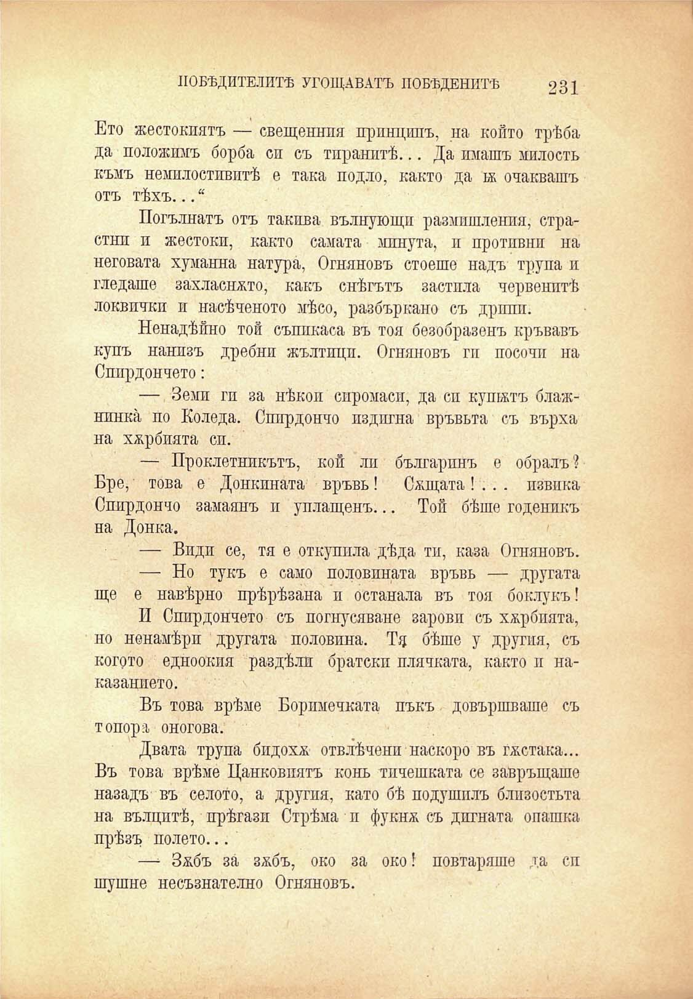

ПОБѢДИТЕЛИТѢ УГОЩАВАТЪ ПОБѢДЕНИТѢ

231

Ето жестокиятъ — свещеннпя принципъ, на който трѣба да положилъ борба си съ тиранитѣ... Да имашъ милость къмъ немилостивитѣ е така подло, както да тя очаквашъ отъ тѣхъ... “

Погълнатъ отъ такива вълнующп размишления, страстнп и жестоки, както самата минута, и противни на неговата хуманна натура, Огняновъ стоеше надъ трупа и гледаше захласнато, какъ снѣгътъ застила червенитѣ локвпчкп и насѣченото мѣсо, разбъркано съ дрипи.

Ненадѣйно той съппкаса въ тоя безобразенъ кръвавъ купъ нанизъ дребни жълтици. Огняновъ ги посочи на Спирдончето:

— Земи ги за нѣкои сиромаси, да си кушятъ блажнинка, по Коледа. Спирдончо издигна връвьта съ върха на хярбпята сп.

— Проклетникътъ, кой ли българинъ е обралъ ? Бре, това е Донкината връвь! Сящата! .. . извика Спирдончо замаянъ и уплащенъ... Той бѣше годеникъ на Донка.

— Види се, тя е откупила дѣда ти, каза Огняновъ.

— Но тукъ е само половината връвь — другата ще е навѣрно прѣрѣзана и останала въ тоя боклукъ!

И Спирдончето съ погнусяване зарови съ хярбпята, но ненамѣрп другата половина. Тя бѣше у другия, съ когото едноокия раздѣли братски плячката, както и наказанието.

Въ това врѣме Боримечката пъкъ довършваше съ топора оногова.

Двата трупа бпдохя отвлѣчени наскоро въ гѫстака... Въ това врѣме Цанковиятъ конь тичешката се завръщаше назадъ въ селото, а другия, като бѣ подушилъ близостьта на вълцитѣ, прѣгази Стрѣма и фукня съ дигната опашка прѣзъ полето...

—* Зябъ за зябъ, око за око! повтаряше да сп шушне несъзнателно Огняновъ.

