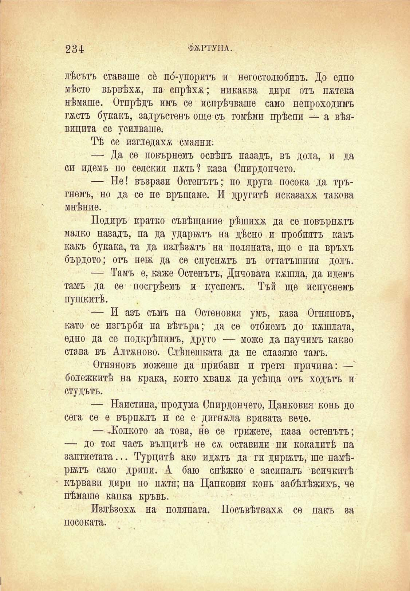

234

ФОРТУНА.

лѣсътъ ставаше се по́-упоритъ и негостолюбивъ. До едно мѣсто вьрвѣхж, па спрѣха; никаква диря отъ пжтека нѣмаше. Отпрѣдъ имъ се попрѣчваше само непроходимъ гжстъ букакъ, задръстенъ още съ гомѣми прѣспи — а вѣявицита се усилваше.

Тѣ се изгледаха смаяни;

— Да се повърнемъ освѣнъ назадъ, въ дола, и да си идемъ по селския пжть? каза Спирдончето.

— Не! възрази Остенътъ; по друга посока да тръгнемъ, но да се не връщаме. И другитѣ исказахж такова мнѣние.

Подиръ кратко съвѣщание рѣшихж да се повърнжтъ малко назадъ, па да ударятъ на дѣсно и пробиятъ какъ какъ букака, та да излѣзатъ на поляната, що е на връхъ бърдото; отъ нея да се спуснатъ въ оттатъшния долъ.

— Тамъ е, каже Остенътъ, Дичовата кашла, да идемъ тамъ да се посгрѣемъ и куснемъ. Тъй ще испуснемъ пушкитѣ.

— И азъ съмъ на Остеновия умъ, каза Огняновъ, като се изгърби на вѣтъра; да се отбиемъ до кашлата, едно да се подкрѣпимъ, друго — може да научимъ какво става въ Алтаново. Слѣпешката да не слазяме тамъ.

Огняновъ можеше да прибави и третя причина: — болежкитѣ на крака, който хванж да усѣща отъ ходътъ и студътъ.

— Наистина, продума Спирдончето, Цанковия конь до сега се е върнжлъ и се е дпгнжла врявата вече.

— .Колкото за това, не се грижете, каза остенътъ; — до тоя часъ вълцитѣ не сѫ оставили ни кокалитѣ на заптиетата... Турцитѣ ако иджтъ да ги дирятъ, ше намѣрятъ само дрипи. А баю снѣжно е засипалъ всичкитѣ кървави дири по пжтя; на Цанковия конь забѣлѣжихъ, че нѣмаше капка кръвь.

Излѣзохж на поляната. Посъвѣтвахж се пакъ за

посоката.

