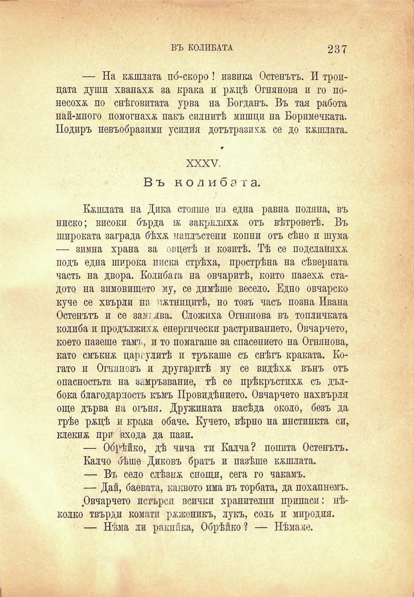

ВЪ КОЛИБАТА

237

— На копата по́-скоро! извика Остенътъ. И тропцата души хванаха за крака и ржцѣ Огнянова и го понесохѫ по снѣговитата урва на Богданъ. Въ тая работа най-много помогнаха пакъ силнитѣ мишци на Боримечката. Подиръ невъобразими усилия дотътразикя се до кжшлата.

XXXV.

Въ колибата.

Кжшлата на Дика стояше па една равна поляна, въ ниско; високи бърда ж закриляха отъ вѣтроветѣ. Въ широката заграда бѣхя. паплъстени копни отъ сѣно и шума — зимна храна за овцетѣ и козитѣ. Тѣ се подсланяхя подъ една широка ниска стрѣха, прострѣна на сѣверната часть на двора. Колиба га на овчаритѣ, който назеха стадото на зимовището му, се димѣше весело. Едно овчарско куче се хвърли на потницитѣ, но тозъ часъ позша Ивана Остенътъ и се заш лва. Сложиха Огнянова въ топличката колиба и продължихѫ енергически растриванието. Овчарчето, което пазеше тамъ, и то помагаше за спасението на Огнянова, като смъкна царгулитѣ и тръкаше съ снѣгъ краката. Когато и Огняновъ и другаритѣ му се видѣха вънъ отъ опасностьта на зимръзвание, тѣ се прѣкръстихѫ съ дълбока благодарность къмъ Провидѣнието. Овчарчето нахвърля още дърва на огъня. Дружината насѣда около, безъ да. грѣе ряцѣ и крака обаче. Кучето, вѣрно на инстинкта си, клекна при входа да пази.

— Обрѣйко, дѣ чича ти Калча? попита Остенътъ. Калчо бѣше Диковъ братъ и пазѣше копата.

— Въ село слѣзиж снощи, сега го чакамъ.

— Дай, баевата, каквото има въ торбата, да похапнемъ.

Овчарчето истърсп всички хранителни припаси: нѣколко твърди комати ряженикъ, лукъ, соль и миродия.

— Нѣма ли ракийка, Обрѣйко? — Нѣмаме.

