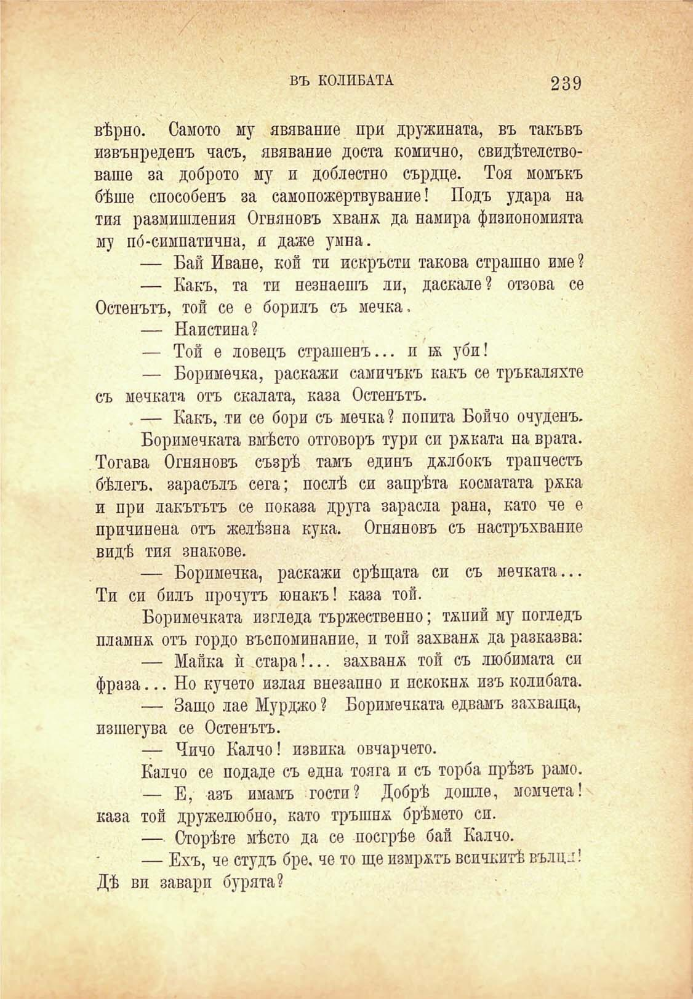

ВЪ КОЛИБАТА

239

вѣрно. Самото му явявание при дружината, въ такъвъ извънреденъ часъ, явявание доста комично, свидѣтелствоваше за доброто му и доблестно сърдце. Тоя момъкъ бѣше способенъ за самопожертвувание! Подъ удара на тия размишления Огняновъ хванж да намира физиономията му по́-симпатична, и даже умна.

— Бай Иване, кой ти покръсти такова страшно име 2 — Какъ, та ти незнаещъ ли, даскале? отзова се Остенътъ, той се е борилъ съ мечка.

— Наистина?

— Той е ловецъ страшенъ... и тж уби!

— Боримечка, раскажи самичъкъ какъ се тръкаляхте съ мечката отъ скалата, каза Остенътъ.

. — Какъ, ти се бори съ мечка? попита Бойчо очуденъ. Боримечката вмѣсто отговоръ тури си рѣката на врата. Тогава Огняновъ съзрѣ тамъ единъ джлбокъ трапчестъ бѣлегъ. зарасълъ сега; послѣ си запрѣта косматата ржка и при лакътьтъ се показа друга зарасла рана, като че е причинена отъ желѣзна кука. Огняновъ съ настръхвание видѣ тия знакове.

— Боримечка, раскажи срѣщата си съ мечката... Ти си билъ прочутъ юнакъ! каза той.

Боримечката изгледа тържествений; тжпий му погледъ пламна отъ гордо въспоминание, и той захвана да разказва:

— Майка ѝ стара!... захвана той съ любимата си фраза... Но кучето излая внезапно и искокнж изъ колибата.

— Защо лае Мурджо ? Боримечката едвамъ захваща, изшегува се Остенътъ.

— Чичо Калчо! извика овчарчето.

Калчо се подаде съ една тояга и съ торба прѣзъ рамо.

— Е, азъ имамъ гости? Добрѣ дошле, момчета! каза той дружелюбно, като тръшна брѣмето сп.

— Сторѣте мѣсто да се посгрѣе бай Калчо.

— Ехъ, че студъ бре. че то ще измратъ всичкитѣ вълцл! Дѣ ви завари бурята?

