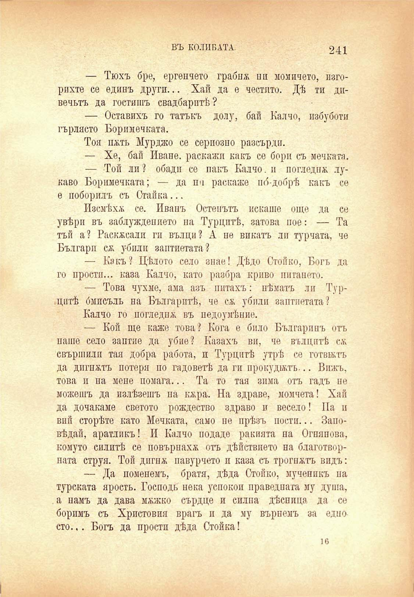

ВЪ КОЛИБАТА.

241

— Тюхъ бре, ергенчето грабнж пи момичето, наторихте се единъ други... Хай да е честито. Дѣ ти дпвечьтъ да гостишъ свадбарптѣ ?

— Оставихъ го татъкъ долу, бай Калчо, избуботи гърлясто Боримечката.

Тоя пжть Мурджо се сериозно разсърди.

— Хе, бай Иване. раскажи какъ се бори съ мечката.

— Той ли ? обади се пакъ Калчо. и погледна лукаво Боримечката; — да пи раскаже по́-добрѣ какъ се е поборилъ съ Стайна...

Изсмѣхѫ се. Иванъ Остенътъ искаше още да се увѣри въ заблуждението па Турцитѣ, затова пое: — Та тъй а? Раскжсалп ги вълци? А не викатъ ли турната, че Българи сѫ убпли заптиетата?

— Какъ? Цѣлото село знае! Дѣдо Стойко, Богъ да го прости... каза Калчо, като разбра криво питането.

— Това чухме, ама азъ питахъ: нѣматъ ли Турцитѣ бмисъль на Българитѣ, че сѫ убпли заптиетата?

Калчо го погледна въ недоумѣние.

— Кой ще каже това? Кога е било Българинъ отъ наше село заптие да убие? Казахъ ви, че вълцитѣ сж свършилп тая добра работа, и Турцитѣ утрѣ се готвилъ да дигпжтъ потеря по гадоветѣ да ги прокудилъ... Вижъ, това и па мене помага... Та то тая зима отъ гадъ не можешъ да излѣзешъ па кжра. На здраве, момчета! Хай да дочакаме светото рождество здраво и весело! Па и вий сторѣте като Мечката, само пе прѣзъ пости... Заповѣдай, аратликъ! И Калчо подаде ракията па Огнянова, комуто силитѣ се повърнахж отъ дѣйствпето на благотворпата струя. Той дигнж павурчето и каза съ трогпжтъ видъ:

— Да поменемъ, братя, дѣда Стоико, мученикъ па турската ярость. Господь нека успокои праведната му душа, а намъ да дава мжжко сърдце и силна дѣсница да се боримъ съ Христовпя врагъ и да му върнемъ за едно сто.,. Богъ да проста дѣда Стойка!

ю

