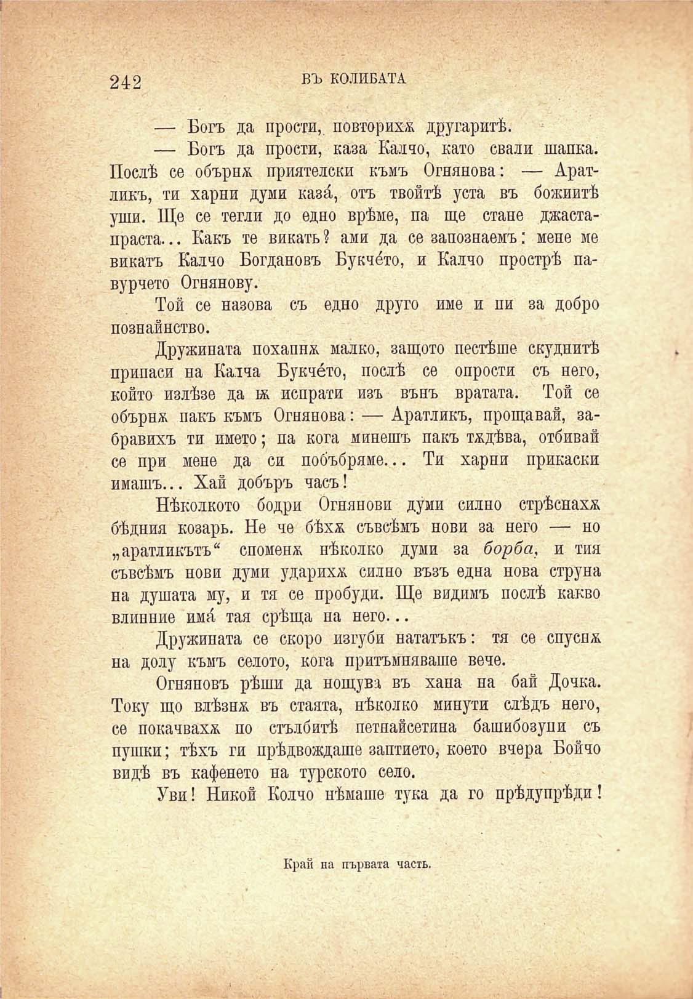

242	ВЪ КОЛИБАТА

— Богъ да прости, повторихѫ другаритѣ.

— Богъ да прости, каза Калчо, като свали шапка. Послѣ се обърна приятелски къмъ Огнянова: — Аратликъ, ти харни думи каз^, отъ твойтѣ уста въ божиитѣ уши. Ще се тегли до едно врѣме, па ще стане джастапраста... Какъ те викать ? ами да се запознаемъ: мене ме викатъ Калчо Богдановъ Букчо́то, и Калчо прострѣ павурчето Огнянову.

Той се назова съ едно друго име и пи за добро познайнство.

Дружината похапна малко, защото пестѣше скуднитѣ припаси на Кална Букче́то, послѣ се опрости съ него, който излѣзе да ж испрати изъ вънъ вратата. Той се обърнж пакъ къмъ Огнянова: — Аратликъ, прощавай, забравихъ ти името; па кога минешъ пакъ тадѣва, отбивай се при мене да си побъбряме... Ти харни прикаски имашъ... Хай добъръ часъ!

Нѣколкото бодри Огнянови думи силно стрѣснаха бѣдния козарь. Не че бѣхх съвсѣмъ нови за него — но „аратликътъ“ спомена нѣколко думи за борба, и тия съвсѣмъ нови думи ударихѫ силно възъ една нова струна на душата му, и тя се пробуди. Ще видимъ послѣ какво влинние имй, тая срѣща па него...

Дружината се скоро изгуби нататъкъ: тя се спусна на долу къмъ селото, кога притъмняваше вече.

Огняновъ рѣши да нощува въ хапа на бай Дочка. Току що влѣзна въ стаята, нѣколко минути слѣдъ него, се покачваха по стълбитѣ петнайсетина башибозуци съ пушки; тѣхъ ги прѣдвождаше заптието, което вчера Бойчо видѣ въ кафенето на турското село.

Уви! Никой Колчо нѣмаше тука да го прѣдупрѣди!

Край на първата часть.

