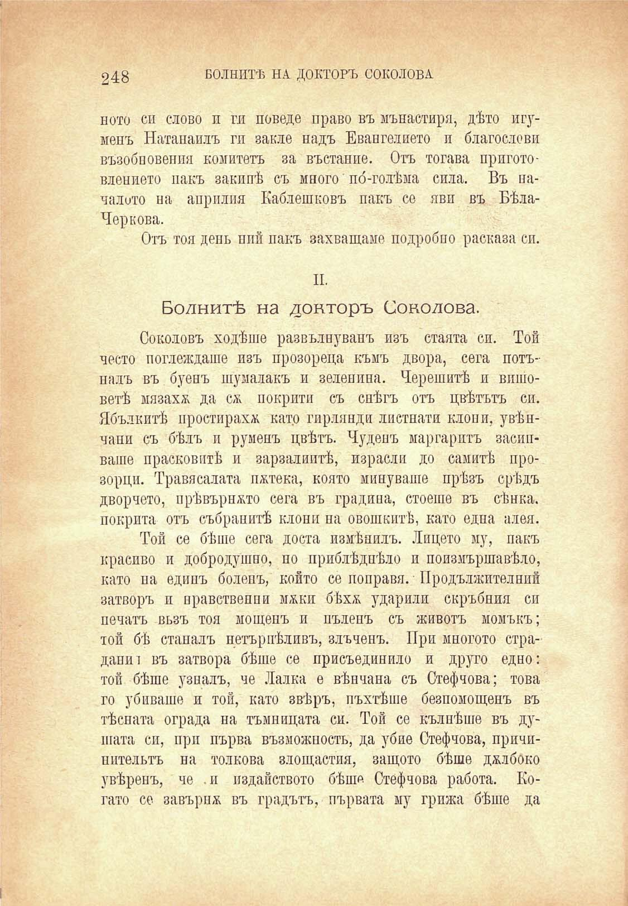

248

БОЛНИТѢ НА ДОКТОРЪ СОКОЛОВА

ното си слово и ги поведе право въ мънастиря, дѣто игумепъ Натанаилъ ги закле надъ Евангелието и благослови възобновения комитетъ за въстание. Отъ тогава приготовлението пакъ закипѣ съ много по́-голѣма сила. Въ началото на априлня Каблешковъ пакъ се яви въ БѣлаЧеркова.

Отъ тоя день пий пакъ захващаме подробно расказа сп.

II.

Болнитѣ на докторъ Соколова.

Соколовъ ходѣше развълнуванъ изъ стаята си. Той често поглеждаше изъ прозореца къмъ двора, сега потъналъ въ буенъ шумалакъ и зеленина. Черешитѣ и вишоветѣ мязахж да сѫ покрити съ снѣгъ отъ цвѣтътъ си. Ябълкитѣ нростирахж като гирлянди листнати клони, увѣнчани съ бѣлъ и руменъ цвѣтъ. Чуденъ маргаритъ засипваше прасковитѣ и зарзалиптѣ, израсли до самитѣ прозорци. Травясалата пжтека, която минуваше прѣзъ срѣдъ дворчето, прѣвърнато сега въ градина, стоеше въ сѣнка, покрита отъ събранитѣ клони па овошкитѣ, като една алея.

Той се бѣше сега доста измѣнилъ. Лицето му, пакъ красиво и добродушно, но приблѣдпѣло и поизмършавѣло, като на единъ боленъ, който се поправя. Продължителний затворъ и нравствений мжки бѣхѫ ударили скръбния си печатъ възъ тоя мощенъ и пъленъ съ животъ момъкъ; той бѣ станалъ иетърнѣливъ, злъченъ. При многото страдани! въ затвора бѣше се присъединило и друго едно: той бѣше узналъ, че Лалка е вѣнчана съ Стефчова; това го убиваше и той, като звѣръ, пъхтѣше безпомощенъ въ тѣсната ограда на тъмницата си. Той се кълнѣше въ душата си, при първа възможность, да убие Стефчова, причинительтъ на толкова злощастия, защото бѣше джлбоко увѣренъ, че и издайството бѣше Стефчова работа. Когато се завърпж въ градътъ, първата му грижа бѣше да

