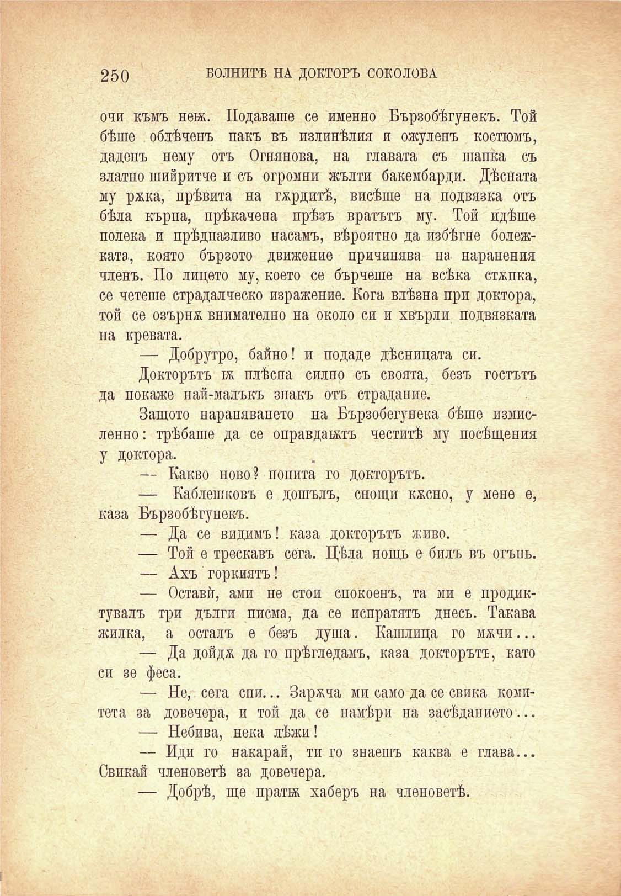

250

БОЛНИТѢ НА ДОКТОРЪ СОКОЛОВА

очи къмъ нея. Подаваше се именно Бързобѣгунекъ. Той бѣше облѣченъ пакъ въ излинѣлия и ожуленъ костюмъ, даденъ нему отъ Огнянова, на главата съ шапка съ златно шийритче и съ огромни жълти бакембарди. Дѣсната му ржка, прѣвита на гордитѣ, висѣше на подвязка отъ бѣла кърпа, прѣкачена прѣзъ вратътъ му. Той идѣше полека и прѣдпазливо насамъ, вѣроятно да избѣгне болежката, която бързото движение причинява на наранения членъ. По лицето му, което се бърчеше на всѣка стѫпка, се четеше страдалческо изражение. Кога влѣзна при доктора, той се озърна внимателно на около си и хвърли, подвязката на кревата.

— Добрутро, байно! и подаде дѣсницата си.

Докторътъ я плѣсна силно съ своята, безъ гостътъ да покаже пай-малъкъ знакъ отъ страдание.

Защото нараняването на Бързобегупека бѣше измисленно: трѣбаше да се оправдаятъ честитѣ му посѣщения у доктора.

— Какво ново? попита го докторътъ.

— Каблешковъ е дошълъ, снощи кжспо, у мене е, каза Бързобѣгунекъ.

— Да се видимъ! каза докторътъ живо.

— Той е трескавъ сега. Цѣла нощь е билъ въ огънь. — Ахъ горкиятъ!

— Оставѝ, ами пе стои спокоенъ, та ми е продиктувалъ три дълги писма, да се испратятъ днесъ. Такава жилка, а осталъ е безъ душа. Кашлица го мжчи...

— Да дойдж да го прѣгледамъ, каза докторътъ, като си зе феса.

— Не, сега спи... Зареча ми само да се свика комитета за довечера, и той да се намѣри на засѣданието...

— Небива, нека лѣжи!

— Иди го накарай, ти го знаешъ каква е глава... Свикай членоветѣ за довечера.

— Добрѣ, ще пратя хаберъ на членоветѣ.

