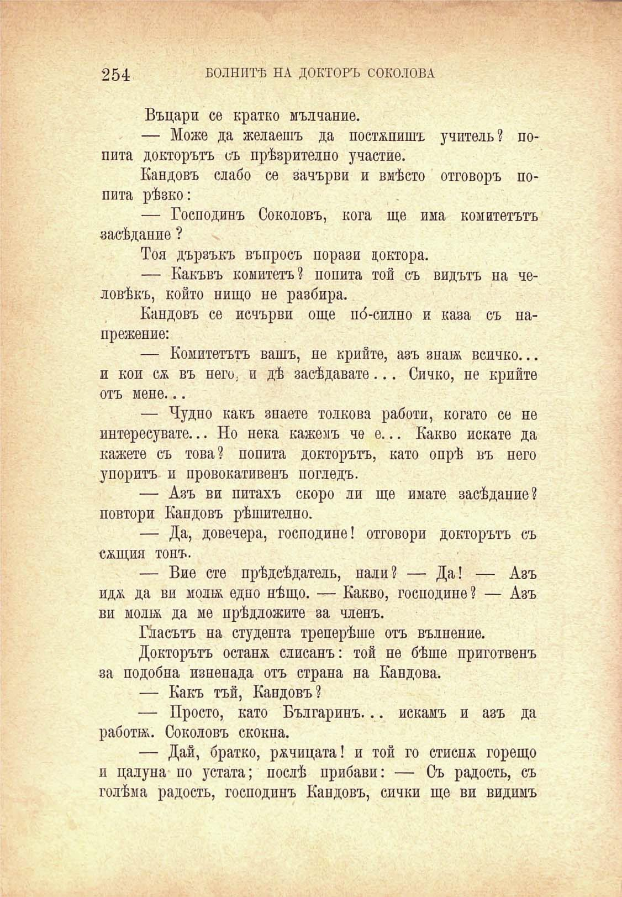

254

БОЛНИТѢ НА ДОКТОРЪ СОКОЛОВА

Въцари се кратко мълчание.

— Може да желаешъ да постѫпишъ учитель? попита докторътъ съ прѣзрително участие.

Кандовъ слабо се зачърви и вмѣсто отговоръ попита рѣзко:

— Господинъ Соколовъ, кога ще има комитетътъ засѣдание ?

Тоя дързъкъ въпросъ порази доктора.

— Какъвъ комитетъ? попита той съ видътъ на человѣкъ, който нищо не разбира.

Кандовъ се исчърви още по́-силно и каза съ напрежение:

— Комитетътъ вашъ, не крийте, азъ знай; всичко... и кои сѫ въ него; и дѣ засѣдавате... Сичко, не крийте отъ мене...

— Чудно какъ знаете толкова работи, когато се не интересувате... Но нека кажемъ че е... Какво искате да кажете съ това? попита докторътъ, като опрѣ въ него упоритъ и провокативенъ погледъ.

— Азъ ви питахъ скоро ли ще имате засѣдание? повтори Кандовъ рѣшително.

— Да, довечера, господине! отговори докторътъ съ сжщия тонъ.

— Вие сте прѣдсѣдатель, нали? — Да! — Азъ идж да ви молж едно нѣщо. — Какво, господине? — Азъ ви молбь да ме прѣдложите за членъ.

Гласътъ на студента треперѣше отъ вълнение.

Докторътъ останж слисанъ: той не бѣше приготвенъ за подобна изненада отъ страна на Кандова.

— Какъ тъй, Кандовъ?

— Просто, като Българинъ... искамъ и азъ да работа. Соколовъ скокна.

— Дай, братко, ржчицата! и той го стиснж горещо и цалуна по устата; послѣ прибави: — Съ радость, съ голѣма радость, господинъ Кандовъ, сички ще ви видимъ

