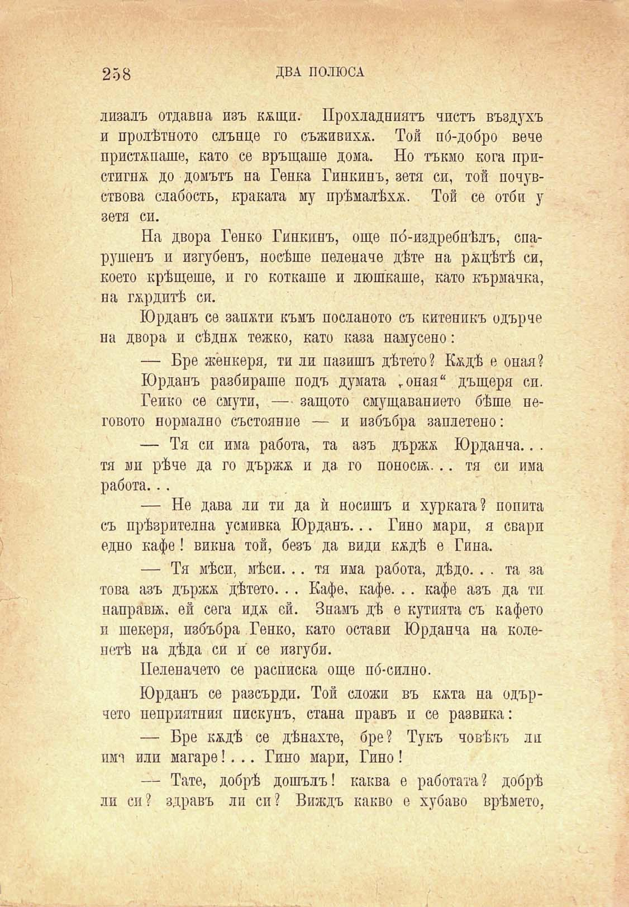

258

ДВА ПОЛЮСА

лизалъ отдавна изъ к&щи. Прохладниятъ чистъ въздухъ и пролѣтното слънце го съживиха. Той по́-добро вече пристѫпяше, като се връщаше дома. Но тъкмо кога пристигпж до домътъ на Генка Гипкинъ, зетя си, той почувствова слабость, краката му прѣмалѣха. Той се отби у зетя си.

На двора Генко Гинкинъ, още по́-издребнѣлъ, спарушенъ и изгубенъ, носѣше пеленаче дѣте на рѫцѣтѣ си, което крѣщеше, и го коткаше и люшкаше, като кърмачка, на гордитѣ си.

Юрданъ се запхти къмъ посланото съ китеникъ одърче на двора и сѣднж тежко, като каза намусено:

— Бре женкеря, ти ли пазишъ дѣтето? Кхдѣ е оная? Юрданъ разбираше подъ думата гоная“ дъщеря си. Генко се смути, — защото смущаването бѣше пеговото нормално състояние — и избъбря заплетено:

— Тя си има работа, та азъ държж Юрданча.. . тя ми рѣче да го държж. и да го поноси... тя си има работа...

— Не дава ли ти да ѝ носишъ и хурката? попита съ прѣзрителна усмивка Юрданъ... Гино мари, я свари едно кафе! викна той, безъ да види квдѣ е Гина.

— Тя мѣси, мѣси. .. тя има работа, дѣдо. . . та за това азъ държж дѣтето. .. Кафе, кафе. .. кафе азъ да ти паправж. ей сега идж ей. Знамъ дѣ е кутията съ кафето и шекеря, избъбра Генко, като остави Юрданча на колепетѣ на дѣда си ѝ се изгуби.

Пеленачето се расписка още по́-силно.

Юрданъ се разсърди. Той сложи въ кжта на одърчето неприятния пискунъ, стана правъ и се развика:

— Бре кждѣ се дѣнахте, бре? Тукъ човѣкъ ли пма или магаре! . .. Гино мари, Гино !

— Тате, добрѣ дошълъ! каква е работата? добрѣ ли си? здравъ ли си? Виждъ какво е хубаво врѣмето,

