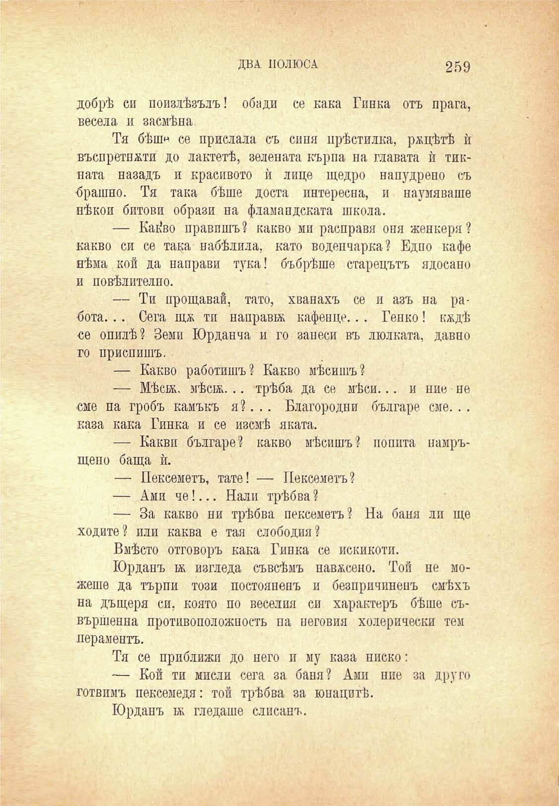

ДВА ПОЛЮСА

259

добрѣ си поизлѣзълъ! обади се кака Гинка отъ прага, весела и засмѣна.

Тя бѣш* се прислала съ сипя прѣстилка, ржцѣтѣ ѝ въспретнжти до лактетѣ, зелената кърпа па главата ѝ тикната назадъ и красивото ѝ лице щедро напудрепо съ брашно. Тя така бѣше доста интересна, и наумяваше нѣкои битови образи па фламандската школа.

— Кайво правишъ? какво ми расправя оня женкеря? какво си се така набѣлила, като водепчарка? Едно кафе нѣма кой да направи тука! бъбрѣше старецътъ ядосано и повѣлителпо.

— Ти прощавай, тато, хванахъ се и азъ на работа. . . Сега щж ти направа кафенце.. . Генко! надѣ се опилѣ? Земи Юрданча и го занеси въ люлката, давно го приспишъ.

— Какво работишъ? Какво мѣсишъ?

— Мѣса. мѣса. .. трѣба да се мѣси... и ние не сме на гробъ камъкъ я?. .. Благородни българе сме. . . каза кака Гинка и се изсмѣ яката.

— Какви българе? какво мѣсишъ? попита намръщено баща ѝ.

— Пексеметъ, тате! — Пексеметъ?

— Ами че!... Нали трѣбва ?

— За какво ни трѣбва пексеметъ? На баня ли ще ходите? или каква е тая слободия?

Вмѣсто отговоръ кака Гинка се искикоти.

Юрданъ въ изгледа съвсѣмъ навѫсено. Той не можеше да търпи този постояненъ и безпричиненъ смѣхъ на дъщеря си, която по веселия си характеръ бѣше съвършениа противоположность па неговия холерически тем пераментъ.

Тя се приближи до него и му каза ниско:

— Кой ти мисли сега за баня? Ами пие за друго готвимъ пексемедя: той трѣбва за юнацитѣ.

Юрданъ бк гледаше слисанъ.

