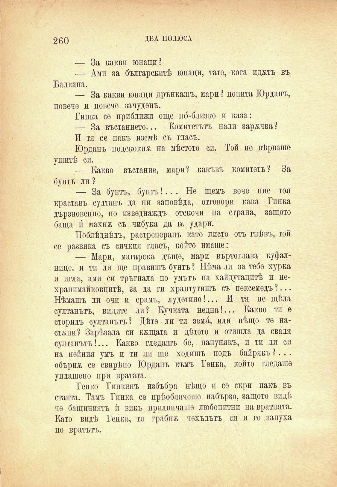

260

ДВА ПОЛЮСА

— За какви юнаци?

— Ами за българскитѣ юнаци, тате, кога ид&тъ въ Балкана,

— За какви юнаци дрънкашъ, мари ? попита Юрданъ, повече и повече зачуденъ.

Гинка се приближи още по́-близко и каза:

— За въстанието... Комитетътъ нали зарѫчва ?

И тя се пакъ изсмѣ съ гласъ.

Юрданъ подскоква на мѣстото си. Той не вѣрваше ушитѣ си.

— Какво въстание, мари? какъвъ комитетъ? За бунтъ ли ?

— За бунтъ, бунтъ!... Не щемъ вече ние тоя краставъ султанъ да ни заповѣда, отговори кака Гинка дързновенно, но изведнаждъ отскочи на страна, защото баща и́ махнх съ чибука да въ удари.

Поблѣднѣлъ, растреперанъ като листо отъ гнѣвъ, той се развика съ сичкия гласъ, който имаше:

— Мари, магарска дъще, мари въртоглава куфалнице. и ти ли ще правишъ бунтъ 2 Нѣма ли за тебе хурка п игла, ами си тръгвала по умътъ на хайдутацитѣ и нехранимайковцитѣ, за да ги хрантутишъ съ пексемедъ ?... Нѣмашъ ли очи и срамъ, лудетино!... И тя не щѣла султанътъ, видите ли? Кучката недна!... Какво ти е сторилъ султанътъ 2 Дѣте ли ти земи́, или нѣщо те настмпи? Зарѣзала си кжщата и дѣтето и отишла да сваля султанътъ!... Какво гледашъ бе, папунякъ, и ти ли си на нейния умъ и ти ли ще ходишъ подъ байракъ ?. . . обърнж се свирѣпо Юрдапъ къмъ Генка, който гледаше уплашено при вратата.

Генко Гинкинъ избъбря нѣщо и се скри пакъ въ стаята. Тамъ Гинка се прѣоблачеше набързо, защото видѣ че бащиниятъ ѝ викъ прилвичаше любопитни на вратнята. Като видѣ Генка, тя грабна чехълътъ си и го запуха по вратътъ.

