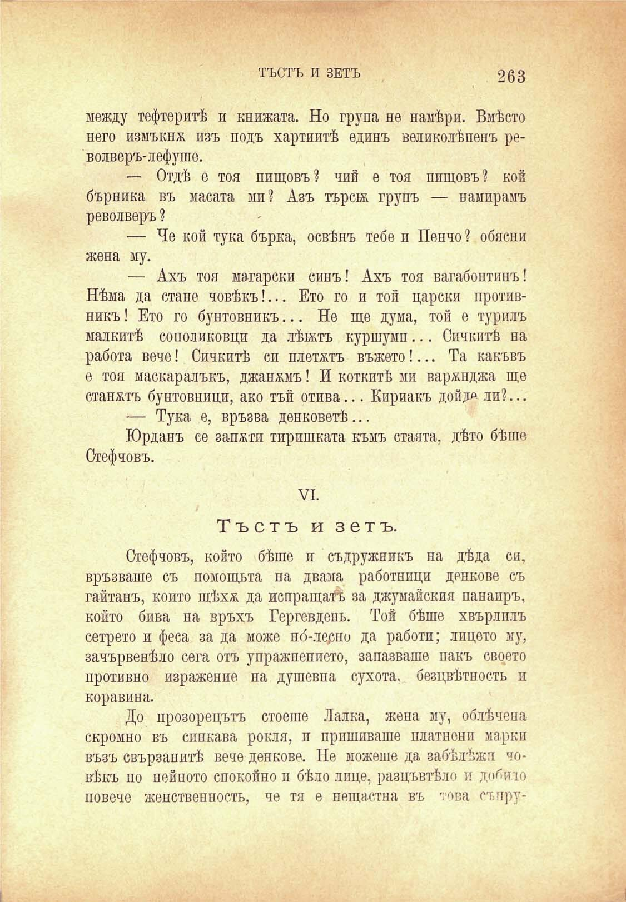

ТЪСТЪ И ЗЕТЪ

263

между тефтеритѣ и книжата. Но група не намѣри. Вмѣсто него измъкна изъ подъ хартиитѣ единъ великолѣпенъ револверъ-лефуше.

— Отдѣ е тоя пищовъ? чий е тоя пищовъ? кой бърника въ масата ми? Азъ търси трупъ — намирамъ револверъ ?

— Че кой тука бърка, освѣнъ тебе и Пенчо ? обясни жена му.

— Ахъ тоя магарски синъ! Ахъ тоя вагабонтинъ! Нѣма да стане човѣкъ!... Ето го и той царски протпвникъ! Ето го бунтовникъ... Не ще дума, той е турилъ малкитѣ сополиковци да лѣнтъ куршуми... Сипкитѣ на работа вече! Сичкитѣ си плетатъ въжето!... Та какъвъ е тоя маскаралъкъ, джапамъ! И коткитѣ ми варжнджа ще станатъ бунтовници, ако тъй отива... Кириакъ дойде ли?...

— Тука е, връзва денковетѣ...

Юрданъ се запоти тиришката къмъ стаята, дѣто бѣше Стефчовъ.

VI.

Тъстъ и зетъ.

Стефчовъ, който бѣше и съдружникъ па дѣда си. връзваше съ помощьта на двама работници денкове съ гайтанъ, копто щѣхѫ да испращатъ за джумайския папапръ, който бива на връхъ Гергевдень. Той бѣше хвърлплъ сетрето и феса за да може но́-лерно да работи; лицето му, зачървенѣло сега отъ упражнението, запазваше пакъ своето противно израженпе на душевна сухота, безцвѣтность п коравина.

До прозорецътъ стоеше Лалка, жена му, облѣчена скромно въ сипкава рокля, и пришиваше платнени марки възъ свързанитѣ вече денкове. Не можеше да забѣлѣжи човѣкъ по нейното спокойно и бѣло лице, разцъвтѣло и дъ^пю повече женствеппостъ, че тя е нещастна въ топа съпру

