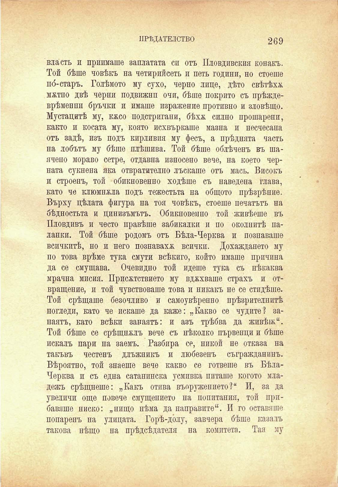

ПРѢДАТЕЛСТВО

269

власть и прилагаше заплатата си отъ Пловдивския конакъ. Той бѣше човѣкъ на четирийсеть и петь години, но стоеше по́-старъ. Голѣмото му сухо, черно лице, дѣто свѣтѣха мжтно двѣ черни подвижнп очи, бѣше покрито съ прѣждеврѣменни бръчки и имаше изражение противно и зловѣщо. Мустацитѣ му, кжсо подстригани, бѣхѫ силно прошаренп, както и косата му, която исхвъркаше мазна и песчесана отъ задѣ, изъ подъ кирливия му фесъ, а прѣднята часть на лобътъ му бѣше плѣшива. Той бѣше облѣченъ въ шаячено мораво сетре, отдавна износено вече, на което черната сукнена яка отвратително лъскаше отъ мась. Високъ и строенъ, той обикновенно ходѣше съ наведена глава, като че клюмнжла подъ тежестьта на общото прѣзрѣние. Върху цѣлата фигура на тоя човѣкъ, стоеше печатътъ на бѣдностьта и цинизъмътъ. Обикновенно той живѣеше въ Пловдивъ и често правѣше забикалки и по околнитѣ паланки. Той бѣше родомъ отъ Бѣла-Черква и познаваше всичкитѣ, но и него познаваха всички. Дохаждането му по това врѣме тука смути всѣкиго, който имаше причина да се смущава. Очевидно той идеше тука съ нѣкаква мрачна мисия. Присѫствието му вдухваше страхъ и отвращение, и той чувствоваше това и никакъ не се стидѣше. Той срѣщаше безочливо и самоувѣренно прѣзрителнитѣ погледи, като че искаше да каже: „Какво се чудите? занаятъ, като всѣки занаятъ: и азъ трѣбва да живѣ»;“. Той бѣше се срѣщналъ вече съ нѣколко първенци и бѣше искалъ пари на заемъ. Разбира се, никой не отказа на такъвъ честенъ длъжникъ и любезенъ съгражданинъ. Вѣроятно, той знаеше вече какво се гответе въ БѣлаЧерква и съ една сатанинска усмивка питаше когото младежъ срѣщнеше: „Какъ отива въоружението?“ И, за да увеличи още повече смущението на попитания, той прибавяше ниско: „нищо нѣма да направите“. И го оставяше попаренъ на улицата. Горѣ-до́лу, завчера бѣше казалъ такова нѣщо на прѣдсѣдателя па комитета. Тая му

