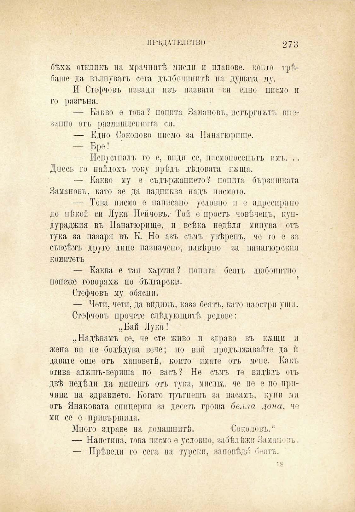

ПРѢДАТЕЛСТВО

273

бѣхл; откликъ па мрачнитѣ мисли и планове, конто трѣбаше да вълнуватъ сега дълбочинитѣ па душата му.

И Стефчовъ извади изъ пазвата си едно писмо и го разгъна.

— Какво е това ? попита Замановъ, истъргиллъ впезаино отъ размишленията си.

— Едно Соколово писмо за Панагюрище.

— Бре!

— Нспустпалъ го е, види се, иисмопосецътъ имъ. .. Днесъ го найдохъ току прѣдъ дѣдовата кмща.

— Какво му е съдържанието? попита бързешката Замановъ. като зе да надниква надъ писмото.

— Това писмо е неписано условно и е адресирано до нѣкой си Лука Найчовъ.- Той е простъ човѣчецъ, кундураджпя въ Панагюрище, и всѣка недѣля мпиува отъ тука за пазаря въ К. Но азъ съмъ увѣренъ, че то е за съвсѣмъ друго лице назначеше, навѣрно за папагюрския комитетъ

— Каква е тая хартия ? попита беятъ любопитно понеже говоряхж по български.

Стефчовъ му обясни.

— Чети, чети, да видимъ, каза беятъ, като наостри уши.

Стефчовъ прочете слѣдующптѣ редове:

..Бай Лука!

„Надѣвамъ се, че сте живо и здраво въ к&щи и жена ви не болѣдува вече; но вий продължавайте да ѝ давате още отъ хаповетѣ, който имате отъ мене. Какъ отива алжшъ-вериша по васъ ? Не съмъ те видѣлъ отъ двѣ недѣли да минешъ отъ тука, мисли;. че пе е по причппа на здравието. Когато тръгнешъ за насамъ, купи ми отъ Знаковата спицерия за десеть гроша бел.т дона. мп се е привършила.

Много здраве на домашнитѣ. Соколовъ."

— Наистина, това писмо е условно, забѣлЬш Замаишъ.

— Прѣведи го сега па турски, заповѣда беятъ.

1 «■'

