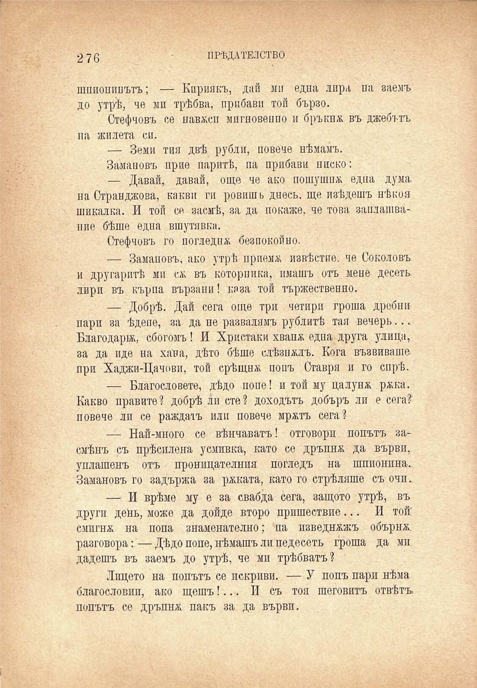

2 76

ПРѢДАТЕЛСТВО

шпионинътъ; — Кириякъ, дай ми една лира на заемъ до утрѣ, че ми трѣбва, прибави той бързо.

Стефчовъ се навжсп мигновение и бръкна въ джобътъ па Жилета си.

— Земи тия двѣ рубли, повече нѣмамъ.

Замановъ прие паритѣ, па прибави ниско:

— Давай, давай, още че ако пошушна една дума на Странджова, какви ги ровишь днесъ, ще изѣдешъ нѣкоя шикалка. И той се засмѣ, за да покаже, че това заплашвание бѣше една вшутявка.

Стефчовъ го погледна безпокойно.

— Замановъ, ако утрѣ приема извѣстие, че Соколовъ и другаритѣ ми са; въ котерийка, имашъ отъ мене десеть, лири въ кърпа вързапи! каза той тържественно.

— Добрѣ. Дай сега още три четири гроша дребни пари за ѣдепе, за да не развалямъ рублитѣ тая вечерь... Благодари, сбогомъ! И Христаки хвапж една друга улица, за да иде на хана, дѣто бѣше слѣзноъ. Кога възвиваше при Хаджи-Цачови, той срѣщна попъ Ставря и го спрѣ.

— Благословете, дѣдо поне! и той му цалунж ржка. Какво правите? добрѣ ли сте? доходътъ добъръ ли е сега?’ повече ли се раждатъ или повече мржтъ сега?

— Най-много се вѣнчаватъ! отговори попътъ засмѣнъ съ прѣсплеиа усмивка, като се дръпна да върви, уплашенъ отъ проницателния погледъ на шпионина. Замановъ го задържа за рѣката, като го стрѣляше съ очи.

— И врѣме му е за свабда сега, защото утрѣ, въ други день, може да дойде второ пришествие... И той смигна на попа знаменателно; па изведнъжъ обърна разговора:—Дѣдо поне, нѣмашъ ли педесеть гроша да ми дадешъ въ заемъ до утрѣ, че ми трѣбватъ?

Лицето на попътъ се пскриви. — У попъ пари нѣма благословип, ако щешъ!... II съ тоя шеговитъ отвѣтъ, попътъ се дръпна пакъ за да вървп.

