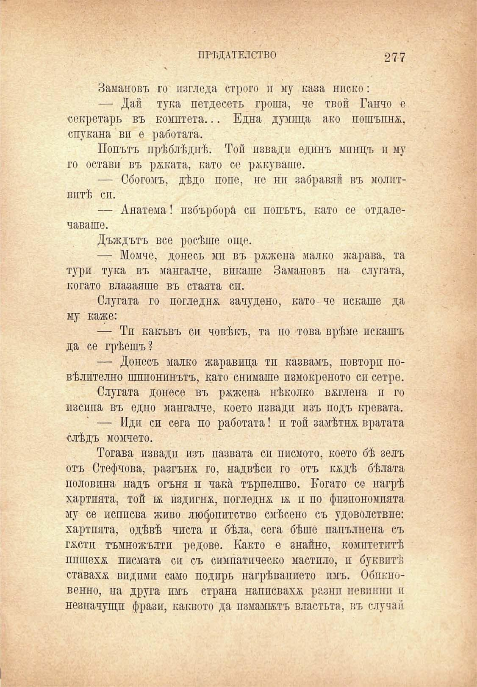

ПРѢДАТЕЛСТВО

277

Замановъ го изгледа строго и му каза ниско:

— Дай тука петдесеть гроша, че твой Ганчо е секретарь въ комитета... Една думица ако пошъпнй;, спукана ви е работата.

Попътъ прѣблѣднѣ. Той извади единъ мпнцъ и му го остави въ рѣката, като се рѫкуваше.

— Сбогомъ, дѣдо попе, не ни забравяй въ молптвптѣ сп.

— Анатема! избърбора́ си попътъ, като се отдалечаваше.

Дъждътъ все росѣше още.

— Момче, донесь мп въ ръжена малко жарава, та тури тука въ мангалче, викаше Замановъ на слугата, когато влазаяше въ стаята сп.

Слугата го погледна зачудено, като че искаше да му каже:

— Ти какъвъ си човѣкъ, та по това врѣме искашъ да се грѣешъ?

— Доносъ малко жаравица ти казвамъ, повтори повѣлително шпионинътъ, като снимаше пзмокреното си сетре.

Слугата донесе въ ржжена нѣколко вѫглена и го изсипа въ едно мангалче, което извади изъ подъ кревата.

— Иди си сега по работата! и той замѣтнж. вратата слѣдъ момчето.

Тогава извади изъ пазвата си писмото, което бѣ зелъ отъ Стефчова, разгъна го, надвѣси го отъ кадѣ бѣлата половина надъ огъня и чака търпеливо. Когато се нагрѣ хартията, той ж издигна, погледна ьь и по физиономията му се исппсва живо любопитство смѣсено съ удоволствие: хартията, одѣвѣ чиста и бѣла, сега бѣше папълнена съ ГДСТИ тъмножълти редове. Както е знайно, комитетитѣ пишеха писмата си съ симпатпческо мастило, и буквитѣ ставаха видими само подиръ нагрѣванието пмъ. Обпкновенно, на друга имъ страна написваха разнп невпннп и незначущп фрази, каквото да измамилъ властьта, въ случай

