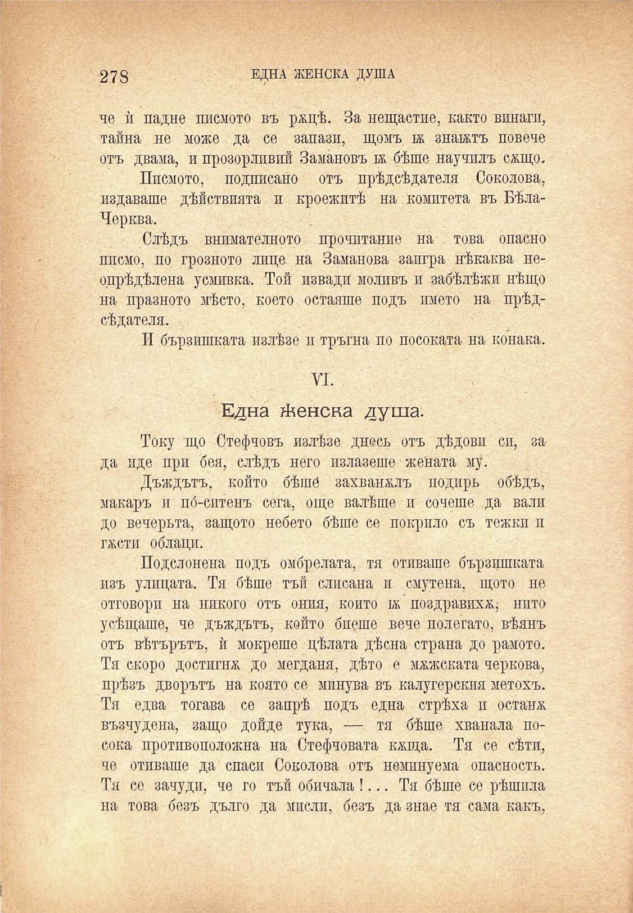

278

ЕДНА ЖЕНСКА ДУША

че ѝ падне писмото въ ржцѣ. За нещастие, както винаги, тайна не може да се запази, щомъ ж знаятъ повече отъ двама, и прозорливий Замановъ ж бѣше научилъ салцо.

Писмото, подписано отъ прѣдсѣдателя Соколова, издаваше дѣйствията и кроежитѣ на комитета въ БѣлаЧерква.

Слѣдъ внимателното прочптание на това опасно ппсмо, по грозното лице на Заманова заигра нѣкаква неопрѣдѣлена усмивка. Той извади моливъ и забѣлѣжи нѣщо на празното мѣсто, което остаяше подъ името на прѣдсѣдателя.

И бързпшката излѣзе и тръгна по посоката на конака.

VI.

Една женска душа.

Току що Стефчовъ излѣзе днесъ отъ дѣдови сп, за да иде при бея, слѣдъ него излазеше жената му.

Дъждътъ, който бѣше захваналъ подиръ обѣдъ, макаръ и по́-ситенъ сега, още валѣше и сочеше да вали до вечерьта, защото. небето бѣше се покрило съ тежки п гжсти облаци.

Подслонена подъ омбрелата, тя отиваше бързпшката изъ улицата. Тя бѣше тъй слисана и смутена, щото не отговори на никого отъ ония, който 1ж поздравихѫ нито усѣщаше, че дъждътъ, който биеше вече полегато, вѣянъ отъ вѣтърътъ, ѝ мокреше цѣлата дѣсна страна до рамото. Тя скоро достигна до мегдани, дѣто е мжжската чернова, прѣзъ дворътъ на която се мпнува въ калугерския метохъ. Тя едва тогава се запрѣ подъ една стрѣха и остана възчудена, защо дойде тука, — тя бѣше хванала посока противоположна на Стефчовата кжща. Тя се сѣтп, че отиваше да спаси Соколова отъ неминуема опасность. Тя со зачуди, че го тъй обичала !... Тя бѣше се рѣшпла на това безъ дълго да мисли, безъ да знае тя сама какъ,

