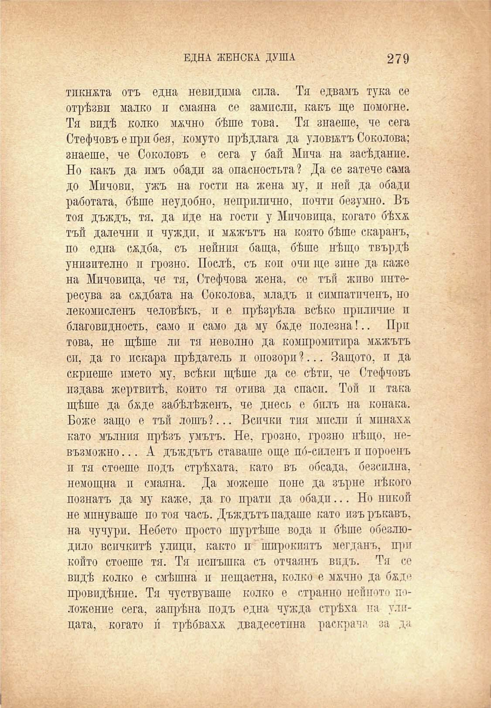

ЕДНА ЖЕНСКА ДУША

279

тикната отъ една невидима сила. Тя едвамъ тука се отрѣзва малко и смаяна се замисли, какъ ще помогне. Тя видѣ колко мжчно бѣше това. Тя знаеше, че сега Стефчовъ е при бея, комуто прѣдлага да уловътъ Соколова; знаеше, че Соколовъ е сега у бай Мпча на засѣдание. Но какъ да пмъ обади за опасностьта ? Да се затече сама до Мичови, ужъ на гости на жена му, и ней да обади работата, бѣше неудобно, неприлично, почти безумно. Въ тоя дъждъ, тя. да иде на гости у Мпчовица, когато бѣхж тъй далечни и чужди, и мѫжътъ на която бѣше скаранъ, по една сждба, съ нейния баща, бѣше нѣщо твърдѣ унизително и грозно. Послѣ, съ кои очи ще зине да каже на Мичовица, че тя, Стефчова жена, се тъй живо иитересува за сѫдбата на Соколова, младъ и симпатиченъ, но лекомисленъ человѣкъ, и е прѣзрѣна всѣко приличие п благовидность, само и само да му баде полезна!.. При това, не щѣше ли тя неволно да компромитира мѫжътъ си, да го покара прѣдатель и опозори ?... Защото, и да скриеше името му, всѣки щѣше да се сѣтп, че Стефчовъ издава жертвитѣ, който тя отива да спаси. Той и така щѣше да бѫде забѣлѣженъ, че днесь е билъ на конака. Боже защо е тъй лошъ?... Всички тия мисли и́ минаха като мълния прѣзъ умътъ. Не, грозно, грозно нѣщо, невъзможно ... А дъждътъ ставаше още по́-силенъ и пороенъ и тя стоеше подъ стрѣхата, като въ обсада, безсилна, немощна и смаяна. Да можеше поне да зърне нѣкого познатъ да му каже, да го прати да обади... Но никой не мпнуваше по тоя часъ. Дъждътъ падаше като изъръкавъ, на чучури. Небето просто шуртѣше вода и бѣше обезлюдило всичкитѣ улици, както и широкиятъ мегданъ, при който стоеше тя. Тя испъшка съ отчаянъ видъ. Тя се видѣ колко е смѣшна и нещастна, колко е мхчно да бждо провидѣнпе. Тя чуствуваше колко е странно нейното положение сега, запрѣна подъ една чужда стрѣха на улпцата, когато и́ трѣбваха двадесетина раскрача за да

