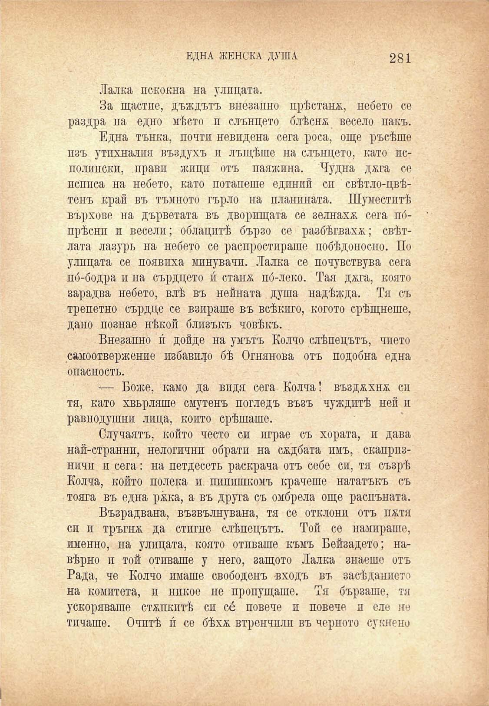

ЕДНА ЖЕНСКА ДУША

281

Лалка покойна на улицата.

За щастие, дъждътъ внезапно прѣстана, небето се раздра на едно мѣсто и слънцето блѣешъ весело пакъ.

Една тънка, почти невпдена сега роса, още ръсѣше изъ утихвалия въздухъ и лъщѣше на слънцето, като исполински, прави жици отъ паяжина. Чудна джга се псппса на небето, като потапеше единни си свѣтло-цвѣтенъ край въ тъмното гърло на планината. Шуместитѣ върхове на дърветата въ дворищата се зелнахж сега пбпрѣснп и весели; облацитѣ бързо се разбѣгваха; свѣтлата лазуръ на небето се распростираше побѣдоносно. По улицата се появиха минувачи. Лалка се почувствува сега пб-бодра и на сърдцето и́ станж по́-леко. Тая джга, която зарадва небето, влѣ въ нейната душа надѣжда. Тя съ трепетно сърдце се взираше въ всѣкпго, когото срѣщнеше, дано познае нѣкой близъкъ човѣкъ.

Внезапно и́ дойде на умътъ Колчо слѣпецътъ, чпето самоотвержено избавпдо бѣ Огнянова отъ подобна една опасность.

— Боже, камо да видя сега Колча! възджхнж сп тя, като хвърляше смутенъ погледъ възъ чуждитѣ неп и равнодушни лица, който срѣщаше.

Случаятъ, който често си играе съ хората, и дава най-страннн, нелогичнп обрати на сждбата имъ, скапризничи и сега: на петдесеть раскрача отъ себе си, тя съзрѣ Колча, който полека и. ппппшкомъ крачеше нататъкъ съ тояга въ една ржка, а въ друга съ омбрела още распъната.

Възрадвана, възвълнувана, тя се отклони отъ пжтя си и тръгнж да стигне слѣпецътъ. Той се намираше, именно, на улицата, която отиваше къмъ Бейзадето; навѣрно и той отиваше у него, защото Лалка знаеше отъ Рада, че Колчо имаше свободенъ входъ въ засѣданието на комитета, и никое не пропущаше. Тя бързаше, тя ускоряваше стжпкитѣ си се повече и повече и ело не тичаше. Очитѣ и́ се бѣхѫ втренчплп въ черното сукнено

