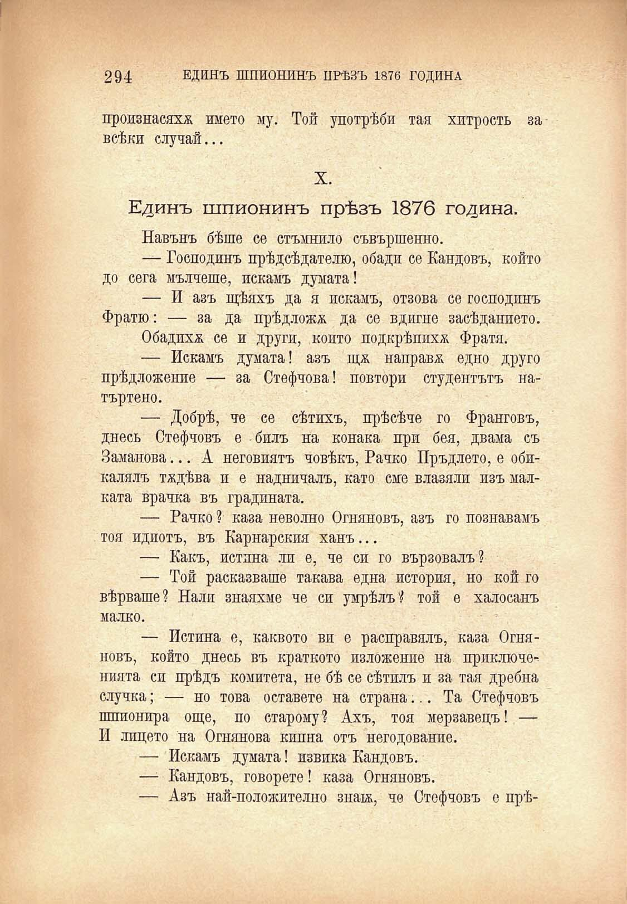

294

ЕДИНЪ ШПИОНИНЪ ПРѢЗЪ 1876 ГОДИНА

произнасяха името му. Той употрѣби тая хитрость за всѣки случай...

X.

Единъ шпионинъ прѣзъ 1876 година.

Навънъ бѣше се стъмнило съвършенно.

— Господинъ прѣдсѣдателю, обади се Кандовъ, който до сега мълчеше, искамъ думата!

— И азъ щѣяхъ да я искамъ, отзова се господинъ Фратю: — за да прѣдложа да се вдигне засѣданието.

Обадиха. се и други, копто подкрѣпихѫ Фратя.

— Искамъ думата! азъ ща направя едно друго прѣдложение — за Стефчова! повтори студентътъ натъртено.

— Добрѣ, че се сѣтихъ, прѣсѣче го Франговъ, днесъ Стефчовъ е билъ на конака при бея, двама съ Заманова... А неговиятъ човѣкъ, Рачко Пръдлето, е обикалялъ тадѣва и е надничалъ, като сме влазяли изъ малката врачка въ градината.

— Рачко ? каза неволно Огняновъ, азъ го познавамъ тоя идиотъ, въ Карнарския ханъ...

— Какъ, истина ли е, че си го вързовалъ?

— Той расказваше такава една история, но кой го вѣрваше? Нали знаяхме че си умрѣлъ? той е халосанъ малко.

— Истина е, каквото ви е расправялъ, каза Огняновъ, който днесъ въ краткото изложение на приключва нията си прѣдъ комитета, не бѣ се сѣтилъ и за тая дребна случка; — но това оставете на страна... Та Стефчовъ шпионира още, по старому? Ахъ, тоя мерзавецъ! — И лицето на Огнянова кипна отъ негодование.

— Искамъ думата! извика Кандовъ.

—■ Кандовъ, говорете! каза Огняновъ.

— Азъ най-положително знай, че Стефчовъ е прѣ-

