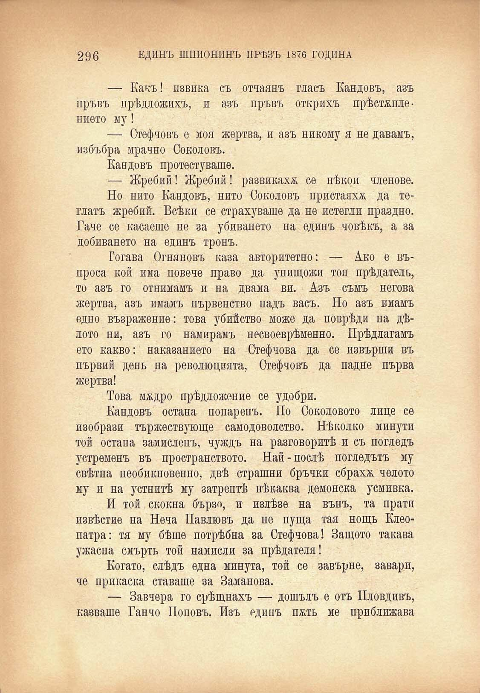

296

ЕДИНЪ ШПИОНИНЪ ПРѢЗЪ 1876 ГОДИНА

— Какъ! извика съ отчаянъ гласъ Кандовъ, азъ пръвъ прѣдложихъ, и азъ пръвъ открихъ прѣстѫплението му!

— Стефчовъ е моя жертва, и азъ никому я не давамъ, избъбря мрачно Соколовъ.

Кандовъ протестуваше.

— Жребий! Жребий! развикаха се нѣкои членове.

Но нито Кандовъ, нито Соколовъ пристаяхж да теглатъ жребий. Всѣки се страхуваше да не истегли праздно. Гаче се касаеше не за убиването на единъ човѣкъ, а за добиването на единъ тронъ.

Тогава Огняновъ каза авторитетно: — Ако е въпроса кой има повече право да унищожи тоя прѣдатель, то азъ го отнимамъ и на двама ви. Азъ съмъ негова жертва, азъ имамъ първенство надъ васъ. Но азъ имамъ едно възражение: това убийство може да поврѣди на дѣлото ни, азъ го намирамъ несвоеврѣменно. Прѣдлагамъ ето какво: наказанието на Стефчова да се извърши въ първий день на революцията, Стефчовъ да падне първа жертва!

Това мадро прѣдложение се удобри.

Кандовъ остана попаренъ. По Соколовото лице се изобрази тържествующе самодоволство. Нѣколко минути той остана замисленъ, чуждъ на разговоритѣ и съ погледъ устременъ въ пространството. Най-послѣ погледътъ му свѣтна необикновенно, двѣ страшни бръчки сбраха челото му и на устнитѣ му затрептѣ нѣкаква демонска усмивка.

И той скокна бързо, и излѣзе на вънъ, та прати извѣстие на Неча Павлювъ да не пуща тая нощь Клеопатра: тя му бѣше потрѣбна за Стефчова! Защото такава ужасна смърть той намисли за прѣдателя!

Когато, слѣдъ една минута, той се завърне, завари, че прикаска ставаше за Заманова.

— Завчера го срѣщнахъ — дошълъ е отъ Пловдивъ, казваше Ганчо Поповъ. Изъ единъ п&ть ме приближава

