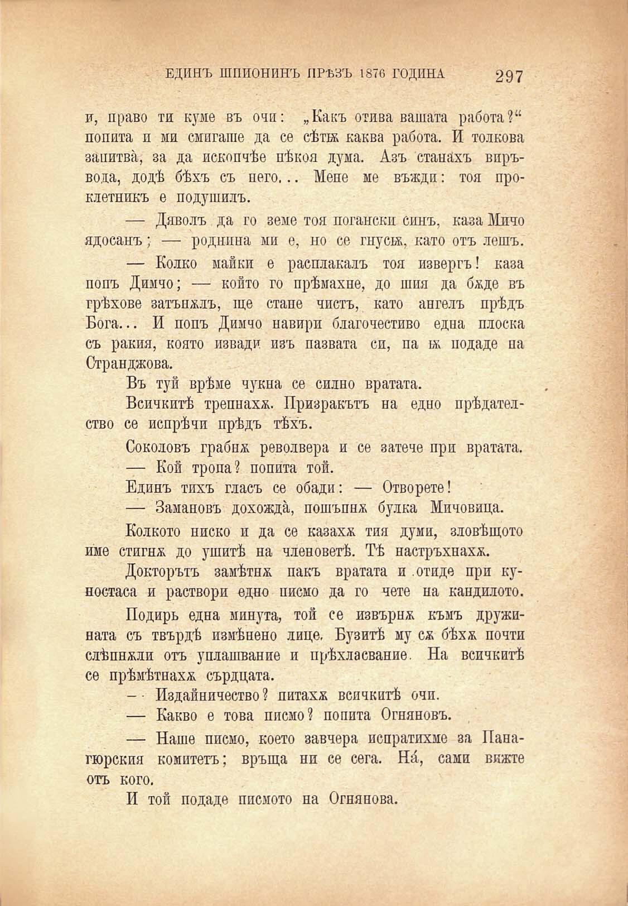

ЕДИНЪ ШПИОНИНЪ ПРЪВЪ 1876 ГОДИНА

297

и, право ти куме въ очи: „Какъ отива вашата работа?“ попита и ми смигаше да се сѣтж каква работа. И толкова запитва, за да ископчѣе нѣкоя дума. Азъ станахъ впръвода, додѣ бѣхъ съ него... Мене ме въжди: тоя проклетникъ е подушилъ.

— Дяволъ да го земе тоя погански синъ, каза Мичо ядосанъ; — роднина ми е, но се гнуси, като отъ лешъ.

— Колко майки е расплакалъ тоя извергъ! каза попъ Димчо; — който го прѣмахне, до шия да бѫде въ грѣхове затъналъ, ще стане чистъ, като ангелъ прѣдъ Бога... И попъ Димчо навири благочестиво една плоска съ ракия, която извади изъ пазвата си, па и подаде па Странджова.

Въ туй врѣме чукна се силно вратата.

Всичкитѣ трепнаха. Призракътъ на едно прѣдателство се испрѣчи прѣдъ тѣхъ.

Соколовъ грабна револвера и се затече при вратата.

— Кой тропа? попита той.

Единъ тихъ гласъ се обади: — Отворете!

— Замановъ дохожда, пошъпнж булка Мичовица.

Колкото ниско и да се казаха тия думи, зловѣщото име стигна до ушитѣ на членоветѣ. Тѣ настръхнаха.

Докторътъ замѣтнж пакъ вратата и .отиде при куностаса и раствори едно писмо да го чете на кандилото.

Подиръ една минута, той се извърна къмъ дружината съ твърдѣ измѣнено лице. Бузитѣ му сѫ бѣхѫ почти слѣпнжли отъ уплашвание и прѣхласвание. На всичкитѣ се прѣмѣтнахж сърдцата.

- • Издайничество ? питахж всичкитѣ очи.

— Какво е това писмо? попита Огняновъ.

— Наше писмо, което завчера испратихме за Панагюрския комитетъ; връща ни се сега. Н^, сами вижте отъ кого.

И той подаде писмото на Огнянова.

