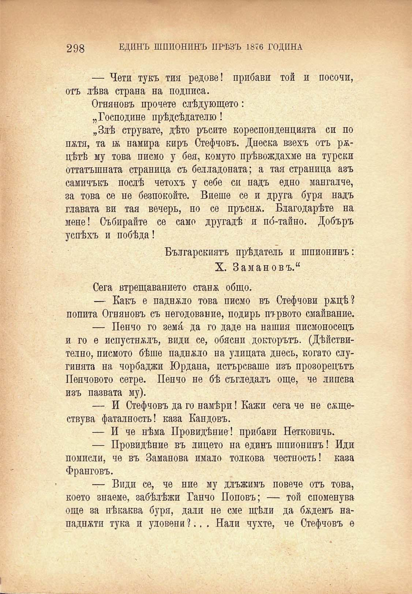

298 ЕДИНЪ ШПИОНИНЪ ПРѢЗЪ 1876 ГОДИНА

— Чети тукъ тия редове! прибави той и посочи, отъ лѣва страна на подписа.

Огняновъ прочете слѣдующето:

„Господине прѣдсѣдателю!

„Злѣ струвате, дѣто ръсите кореспонденцията си по пжтя, та бь намира киръ Стефчовъ. Днеска взехъ отъ ржцѣтѣ му това писмо у бея, комуто прѣвеждахме на турски оттатъшната страница съ белладоната; а тая страница азъ самичъкъ послѣ четохъ у себе си надъ едно мангалче, за това се не безпокойте. Виеше се и друга буря надъ главата ви тая вечерь, но се пръснж. Благодарѣте на мене! Събирайте се само другадѣ и по́-тайно. Добъръ успѣхъ и побѣда!

Българскиятъ прѣдатель и шпионинъ: X. Замановъ.“

Сега втрещаванието станж общо.

— Какъ е паднжло това писмо въ Стефчови ржцѣ? попита Огняновъ съ негодование, подиръ птрвото смайвание.

— Пенчо го земй, да го даде на нашия писмоносецъ и го е испустнжлъ, види се, обясни докторътъ. (Дѣйствително, писмото бѣше паднжло на улицата днесъ, когато слугинята на чорбаджи Юрдана, потърсваше изъ прозорецътъ Пенчовото сетре. Пенчо не бѣ съгледалъ още, че липсва изъ пазвата му).

— И Стефчовъ да го намѣри! Кажи сега че не сѫществува фаталность! каза Кандовъ.

— И че нѣма Провидѣние! прибави Нетковичъ.

— Провидѣние въ лицето на единъ шпионинъ! Иди помисли, че въ Заманова имало толкова честность! каза Франговъ.

— Види се, че ние му длъжимъ повече отъ това, което знаеме, забѣлѣжи Ганчо Поповъ; — той споменува още за нѣкаква буря, дали не сме щѣли да бѫдемъ нападнжти тука и уловени?.. . Нали чухте, че Стефчовъ е

