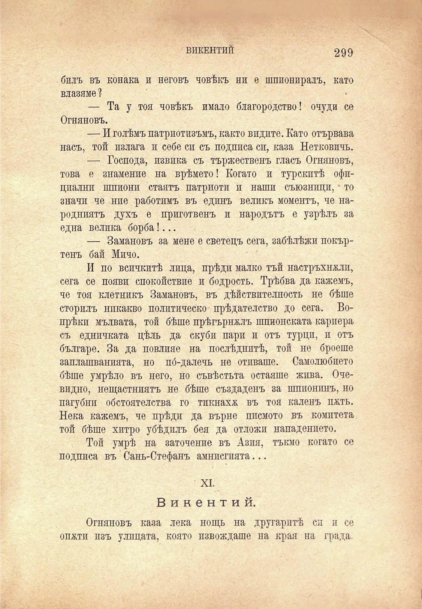

ВИКЕНТИЙ

299

билъ въ конака и неговъ човѣкъ ни е шпиониралъ, като влазяме ?

— Та у тоя човѣкъ имало благородство! очуди се Огняновъ.

— И голѣмъ патриотизъмъ, както видите. Като отървава насъ, той излага и себе си съ подписа сп, каза Нетковичъ.

— Господа, извика съ тържественъ гласъ Огняновъ, това е знамение на врѣмето! Когато и турскитѣ официални шпиони стаятъ патриоти и наши съюзници,' то значи че ние работимъ въ единъ великъ моментъ, че народниятъ духъ е приготвенъ и народътъ е узрѣлъ за една велика борба!...

— Замановъ за мене е светецъ сега, забѣлѣжи покъртенъ бай Мичо.

И по всичкитѣ лица, прѣди малко тъй настръхвали, сега се появи спокойствие и бодрость. Трѣбва да кажемъ, че тоя клетникъ Замановъ, въ дѣйствителность не бѣше сторилъ никакво политическо прѣдателство до сега. Вопрѣки мълвата, той бѣше прѣгърналъ шпионската кариера съ едничката цѣлъ да скуби пари и отъ турци, и отъ българе. За да повлияе на послѣднитѣ, той не броеше заплашванията, но по́-далечь не отиваше. Самолюбието бѣше умрѣло въ него, но съвѣстьта остаяше жива. Очевидно, нещастниятъ не бѣше създаденъ за шпионинъ, но пагубни обстоятелства го тикнаха въ тоя каленъ имъ. Нека кажемъ, че прѣди да върне писмото въ комитета той бѣше хитро убѣдплъ бея да отложи нападението.

Той умрѣ на заточение въ Азия, тъкмо когато се подписа въ Сань-Стефанъ амнистията...

XI.

Викентий.

Огняновъ каза лека нощь на другаритѣ си и се оплети изъ улицата, която пзвождаше иа края на града.

