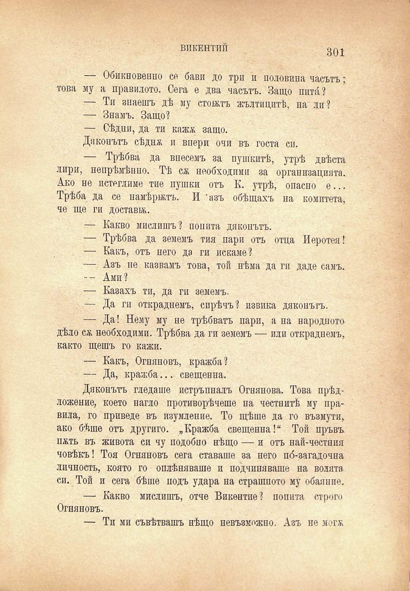

ВИКЕНТИЙ

301

— Обикновений се бави до три и половина часътъ; това му а правилото. Сега е два часътъ. Защо шпи́?

— Ти знаешъ дѣ му стоятъ жълтицитѣ, па ли?

— Знамъ. Защо?

— Сѣдни, да ти кажж защо.

Дяконътъ сѣднж и впери очи въ госта сп.

— Трѣбва да внесемъ за пушкитѣ, утрѣ двѣста лири, непрѣмѣнно. Тѣ сѫ необходими за организацията. Ако не потегляме тие пушки отъ К. утрѣ, опасно е... Трѣба да се намѣрилъ. И 'азъ обѣщахъ на комитета, че ще ги достави.

— Какво мислишъ? попита дяконътъ.

— Трѣбва да земемъ тия пари отъ отца Иеротея!

— Какъ, отъ него да ги искаме?

— Азъ не казвамъ това, той нѣма да ги даде самъ.

-- Ами?

— Казахъ ти, да ги земемъ.

— Да ги откраднемъ, сирѣчъ? извика дяконътъ.

— Да! Нему му не трѣбватъ пари, а на народното дѣло сѫ необходими. Трѣбва да ги земемъ — или откраднемъ, както щешъ го кажи.

— Какъ, Огняновъ, кражба?

— Да, кражба... свещенна.

Дяконътъ гледаше потръпналъ Огнянова. Това прѣдложение, което нагло противорѣчеше па честнитѣ му правила, го приведе въ изумление. То щѣше да го възмути, ако бѣше отъ другиго. „Кражба свещенна!“ Той пръвъ пжть въ живота си чу подобно нѣщо — и отъ най-честния човѣкъ! Тоя Огняновъ сега ставаше за него по́-загадочна личность, която го оплѣняваше и подчиняваше на волята си. Той и сега бѣше подъ удара на страшното му обаяние.

— Какво мислишъ, отче Викентие? попита строго Огняновъ.

— Тп ми съвѣтвашъ нѣщо невъзможно. Азъ не могж

