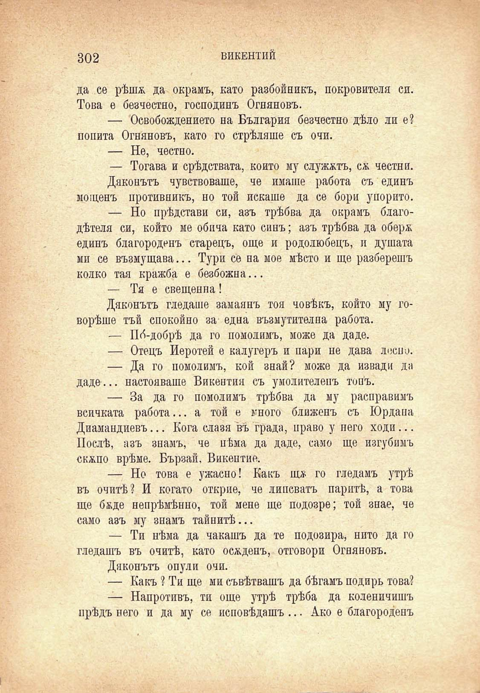

302

ВИКЕНТИЙ

да се рѣшж да окралъ, като разбойникъ, покровителя си. Това е безчестно, господинъ Огняновъ.

— Освобождението на България безчестно дѣло ли е? попита Огняновъ, като го стрѣляше съ очи.

— Не, честно.

— Тогава и срѣдствата, който му служатъ, сѫ честни.

Дяконътъ чувствоваше, че имаше работа съ единъ мощенъ противникъ, но той искаше да се бори упорито.

— Но прѣдстави си, азъ трѣбва да окрамъ благодѣтеля си, който ме обича като синъ; азъ трѣбва да оберж единъ благороденъ старецъ, още и родолюбецъ, и душата ми се възмущава... Тури се на мое мѣсто и ще разберешъ колко тая кражба е безбожна...

— Тя е свещения!

Дяконътъ гледате замаянъ тоя човѣкъ, който му говорѣше тъй спокойно за една възмутителна работа.

— По́-добрѣ да го помолимъ, може да даде.

— Отецъ Иеротей е калугеръ и пари не дава лесно.

— Да го помолимъ, кой знай? може да извади да даде... настояваше Викентия съ умолителенъ тонъ.

— За да го помолимъ трѣбва да му расправимъ всичката работа... а той е много ближенъ съ Юрдана Диамандиевъ... Кога славя въ града, право у него ходи... Послѣ, азъ знамъ, че нѣма да даде, само ще изгубимъ скжпо врѣме. Бързай, Викентие.

— Но това е ужасно! Какъ щж го гледамъ утрѣ въ очитѣ? И когато открие, че липсватъ паритѣ, а това ще бвде непрѣмѣнно, той мене ще подозре; той знае, че само азъ му знамъ тайнитѣ...

— Ти нѣма да чакашъ да те подозира, нито да го гледашъ въ очитѣ, като осжденъ, отговори Огняновъ.

Дяконътъ опули очи.

— Какъ ? Ти ще ми съвѣтвашъ да бѣгамъ подиръ това?

— Напротивъ, ти още утрѣ трѣба да коленичишъ прѣдъ него и да му се исповѣдашъ ... Ако е благороденъ

