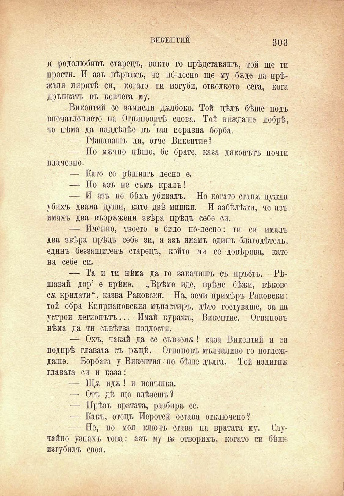

ВИКЕНТИЙ

303

и родолюбивъ старецъ, както го прѣдставяшъ, той ще ти прости. И азъ вѣрвамъ, че по́-лесно ще му бѫде да прѣжали лиритѣ си, когато ги изгуби, отколкото сега, кога дрънкатъ въ ковчега му.

Викентий се замисли джлбоко. Той цѣлъ бѣше подъ впечатлението на Огняновитѣ слова. Той виждаше добрѣ, че нѣма да наддѣлѣе въ тая неравна борба.

— Рѣшавашъ ли, отче Викентие?

— Но мжчно нѣщо, бе брате, каза дяконътъ почти плачевно.

— Като се рѣшишъ лесно е.

— Но азъ не съмъ кралъ!

— И азъ не бѣхъ убивалъ. Но когато стаилъ нужда убихъ двама души, като двѣ мишки. И забѣлѣжи, че азъ имахъ два въорѫжени звѣра прѣдъ себе си.

— Именно, твоето е било по́-леспо: ти си ималъ два звѣра прѣдъ себе зи, а азъ имамъ единъ благодѣтель, единъ беззащитенъ старецъ, който ми се довѣрява, като на себе си.

— Та и ти нѣма да го закачишъ съ пръстъ. Рѣшавай дор’ е врѣме. „Врѣме иде, врѣме бѣжи, вѣкове сж крилати“, казва Раковски. На, земи примѣръ Раковски: той обра Киприановския манастиръ, дѣто гостуваше, за да устрои легионътъ... Имай куражъ, Викентие. Огняновъ нѣма да ти съвѣтва подлости.

— Охъ, чакай да се съвземж! каза Викентий и си подпрѣ главата съ ржцѣ. Огняновъ мълчаливо го поглеждаше. Борбата у Викентия не бѣше дълга. Той издигнж главата си и каза:

— Щж. идж! и испъшка.

— Отъ дѣ ще влѣзешъ?

— Прѣзъ вратата, разбира се.

— Какъ, отецъ Иеротей оставя отключено?

— Не, но моя ключъ става на вратата му. Случайно узнахъ това: азъ му въ отворихъ, когато си бѣше изгубилъ своя.

