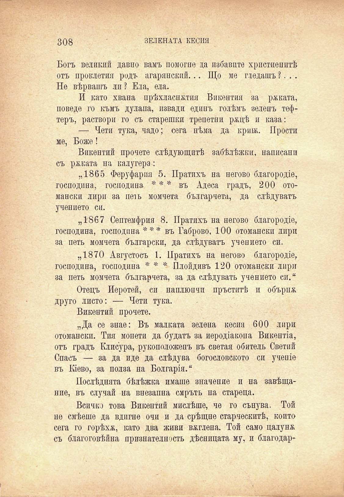

308

ЗЕЛЕНАТА КЕСИЯ

Богъ великий давно валъ помогне да избавите христиенитѣ отъ проклетия родъ агарянский... Що ме гледашъ ?. . .

Не вѣрвашъ ли? Ела, ела.

И като хвана прѣхласнжтия Викентия за рѣката, поведе го къмъ дулапа, извади единъ голѣмъ зеленъ тефтеръ, раствори го съ старешки трепетни ржцѣ и каза:

— Чети тука, чадо; сега нѣма да кршж. Прости ме, Боже!

Викентий прочете слѣдующитѣ забѣлѣжки, написанп съ рѣката на калугера:

„1865 Феруфарпя 5. Пратихъ на негово благородте, господина, господина * * * въ Адеса градъ, 200 отомански лири за петь момчета българиста, да слѣдуватъ учението си.

„1867 Септемфрия 8. Пратихъ на негово благородхе, господина, господина *** въ Габрово, 100 отомански лири за петь момчета български, да слѣдуватъ учението си.

„1870 Августосъ 1. Пратихъ на негово благородие, господина, господина * * * Плойдивъ 120 отомански лири за петь момчета българчета, за да слѣдувать учението си.“

Отецъ Иеротей, си наплюнчи пръститѣ и обърна друго листо: — Чети тука.

Викентий прочете.

„Да се знае: Въ малката зелена кесия 600 лири отомански. Тия монети да будатъ за иеродтакопа ВикенНа, отъ градъ Клисура, рукоположенъ въ светая обитель Светий Спасъ — за да иде да слѣдува богословското си учеше въ Шево, за полза на Болгартя.“

Послѣдната бѣлѣжка имаше значение и на завѣщание, въ случай на внезапна смръть на стареца.

Всичко това Викентий мислѣше, че го сънува. Той не смѣеше да вдигне очи и да срѣщне старческитѣ, който сега го горѣхж, като два живи вѫглена. Той само цалунж съ благоговѣйна признателность дѣсницата му, и благодар

