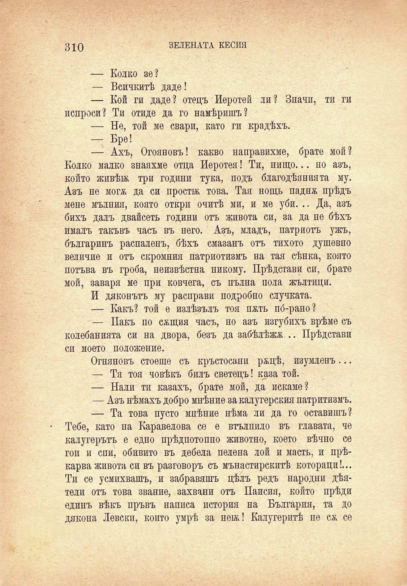

310	ЗЕЛЕНАТА КЕСИЯ

— Колко 86?

— Всичкитѣ даде!

— Кой ги даде? отецъ Иеротей ли? Значи, ти ги испроси? Ти отиде да го намѣришъ?

— Не, той ме свари, като ги крадѣхъ.

— Бре!

— Ахъ, Огояновъ! какво направихме, брате мой? Колко малко знаяхме отца Иеротея! Ти, нищо... но азъ, който живѣж три години тука, подъ благодѣянията му. Азъ не могж да си проста това. Тая нощь паднж прѣдъ мене мълния, която откри очитѣ ми, и ме уби. .. Да, азъ бихъ далъ двайсеть години отъ живота си, за да не бѣхъ ималъ такъвъ часъ въ него. Азъ, младъ, патриотъ ужъ, българинъ распаленъ, бѣхъ смазанъ отъ тихото душевно величие и отъ скромния патриотизмъ на тая сѣнка, която потъва въ гроба, неизвѣстна никому. Прѣдстави си, брате мой, заваря ме при ковчега, съ пълна пола жълтици.

И дяконътъ му расправи подробно случката.

— Какъ? той е излѣзълъ тоя пжть по́-рано?

— Пакъ по сжщия часъ, но азъ изгубихъ врѣме съ колебанията си на двора, безъ да забѣлѣжж .. Прѣдстави си моето положение.

Огняновъ стоеше съ кръстосани ржцѣ, изумленъ... — Тя тоя човѣкъ билъ светецъ! каза той.

— Нали ти казахъ, брате мой, да искаме?

— Азъ нѣмахъ добро мнѣние за калугерския патритизмъ.

— Та това пусто мнѣние нѣма ли да го оставишъ? Тебе, като на Каравелова се е втълпило въ главата, че калугерътъ е едно прѣдпотопно животно, което вѣчно се гои и спи, обивито въ дебела пелена лой и масть, и прѣкарва живота си въ разговоръ съ мънастирскитѣ котораци!... Ти се усмихвашъ, и забравяшъ цѣлъ редъ народни дѣятели отъ това звание, захвани отъ Паисия, който прѣди единъ вѣкъ пръвъ написа история на България, та до дякона Левски, който умрѣ за неж! Калугеритѣ не сѫ се

